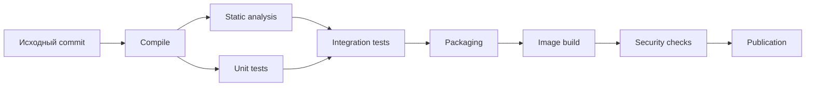

# Построение CI pipeline

## Содержание

1. [Актуальность материала](#актуальность-материала)
2. [Переносимая модель](#переносимая-модель)
3. [Стадии и gates](#стадии-и-gates)
4. [Пример для Java на GitHub Actions](#пример-для-java-на-github-actions)
5. [Производительность и безопасность](#производительность-и-безопасность)
6. [Типичные ошибки](#типичные-ошибки)
7. [Практические упражнения](#практические-упражнения)
8. [Вопросы для самопроверки](#вопросы-для-самопроверки)
9. [Связанные темы](#связанные-темы)

## Актуальность материала

- **Проверено:** 4 августа 2026 года.
- **Целевые версии примера:** Java 21 LTS, Maven 3.9.x, GitHub-hosted `ubuntu-24.04`; GitHub Actions `checkout@v4`, `setup-java@v4`, `upload-artifact@v4`, Docker `build-push-action@v6`.
- **Статус примеров:** `current`; версии action перепроверьте перед копированием и фиксируйте production-зависимости по полному commit SHA.
- **Первичные источники:** [GitHub: build and test Java with Maven](https://docs.github.com/en/actions/use-cases-and-examples/building-and-testing/building-and-testing-java-with-maven), [GitHub artifact attestations](https://docs.github.com/en/actions/security-for-github-actions/using-artifact-attestations), [Maven lifecycle](https://maven.apache.org/guides/introduction/introduction-to-the-lifecycle.html), [Docker build-push action](https://github.com/docker/build-push-action), [SLSA specification](https://slsa.dev/spec/).

## Переносимая модель

Pipeline — ориентированный ациклический граф работ с явными входами, выходами и policy gates. Его контракт не зависит от YAML конкретной платформы:



Переносимые свойства:

- source input — точный commit SHA; зависимости разрешаются из доверенных repositories;
- каждая работа имеет ограниченные permissions, timeout и machine-readable report;
- артефакт собирается один раз, получает checksum/digest, SBOM и provenance;
- publication выполняется только из защищённой ветки/tag, а PR из fork не получает publish secrets;
- кэш ускоряет сборку, но не является release artifact и не должен смешивать недоверенные данные.

Синтаксис `jobs`, `needs`, `${{ }}` и названия actions ниже — специфика GitHub Actions. В GitLab CI, Jenkins, Tekton или AWS CodeBuild сохраните граф и контракты, заменив адаптеры.

## Стадии и gates

| Стадия | Что доказывает | Типичный выход |
|---|---|---|
| Compile | Код и generated sources компилируются | classes, compiler diagnostics |
| Static analysis | Соблюдены style, bug/security rules | SARIF/HTML/XML report |
| Unit tests | Локальная бизнес-логика корректна | JUnit XML, coverage |
| Integration tests | Контракты с БД/брокером работают | JUnit XML, container logs |
| Packaging | Создан deployable package | JAR/WAR + checksum |
| Image build | Package помещён в runtime image | OCI image digest |
| Security checks | Проверены зависимости, source/image, SBOM/policy | отчёт и policy verdict |
| Publication | Проверенный объект помещён в registry | immutable URI/digest + provenance |

`mvn verify` может технически выполнить несколько стадий одной командой. Логически разделяйте результаты и причины отказа; физически не дробите job, если это заставляет повторно компилировать проект и терять feedback speed.

Security checks включают secret scanning до merge, SAST и dependency analysis по source, scan файловой системы/образа и проверку лицензий/policy. Scanner finding не равен риску: задайте severity, exploitability, SLA исключения и владельца waiver.

## Пример для Java на GitHub Actions

Ниже учебный skeleton. `./mvnw` и pinned Maven Wrapper предпочтительнее зависимости от Maven runner; placeholder-команды анализа и scanner надо заменить выбранными командой инструментами.

```yaml
name: java-ci

on:
  pull_request:
  push:
    branches: [main]

permissions:
  contents: read

jobs:
  verify:
    runs-on: ubuntu-24.04
    timeout-minutes: 20
    steps:
      - uses: actions/checkout@v4 # В production фиксируйте полный commit SHA
      - uses: actions/setup-java@v4
        with:
          distribution: temurin
          java-version: '21'
          cache: maven
      - name: Compile
        run: ./mvnw --batch-mode clean compile
      - name: Static analysis
        run: ./mvnw --batch-mode checkstyle:check spotbugs:check
      - name: Unit and integration tests, packaging
        run: ./mvnw --batch-mode verify
      - name: Upload test reports
        if: always()
        uses: actions/upload-artifact@v4
        with:
          name: test-reports-${{ github.sha }}
          path: '**/target/*-reports/**'
          retention-days: 14
      - name: Upload JAR for image job
        uses: actions/upload-artifact@v4
        with:
          name: app-${{ github.sha }}
          path: target/*.jar
          if-no-files-found: error

  image:
    if: github.event_name == 'push' && github.ref == 'refs/heads/main'
    needs: verify
    runs-on: ubuntu-24.04
    permissions:
      contents: read
      packages: write
      id-token: write # Только если нужна OIDC/provenance
    steps:
      - uses: actions/checkout@v4
      - uses: actions/download-artifact@v4
        with:
          name: app-${{ github.sha }}
          path: target
      - name: Login to registry
        uses: docker/login-action@v3
        with:
          registry: ghcr.io
          username: ${{ github.actor }}
          password: ${{ secrets.GITHUB_TOKEN }}
      - name: Build image
        uses: docker/build-push-action@v6
        with:
          context: .
          load: true
          push: false
          tags: ghcr.io/acme/orders:${{ github.sha }}
      - name: Security gate
        run: ./ci/scan-image.sh "ghcr.io/acme/orders:${GITHUB_SHA}"
      - name: Publish image
        run: docker push "ghcr.io/acme/orders:${GITHUB_SHA}"
```

Пример сначала делает build/load и scan локального image, а push — только после gate. Для больших образов альтернативой служит публикация в quarantine repository с последующим promotion digest. Если scanner скачивает уже опубликованный образ, publication ещё не означает допуск к deployment.

Команды Maven следует настроить так, чтобы unit tests исполнял Surefire, integration tests — Failsafe (`integration-test`/`verify`), а package не пропускал тесты. Для интеграций используйте изолированные services или [Testcontainers](../тестирование/02-testcontainers.md).

## Производительность и безопасность

- Запускайте дешёвые проверки раньше и параллельно, отменяйте superseded runs.
- Ключ кэша должен учитывать ОС, JDK и lock/build files; cache miss не должен ломать сборку.
- Минимизируйте `GITHUB_TOKEN` permissions; cloud credentials выдавайте краткоживущими через OIDC.
- Не выполняйте недоверенный PR-код в контексте с secrets (`pull_request_target` особенно опасен).
- Фиксируйте third-party actions по SHA и обновляйте контролируемым ботом.
- Сохраняйте reports даже при отказе (`if: always()`), но publication — только при успехе gates.
- Воспроизводимость проверяйте clean build; не переносите workspace между доверительными границами.

## Типичные ошибки

- **Одна непрозрачная команда:** публиковать отдельные reports и понятные gate names.
- **Image пересобирают перед каждой средой:** продвигать один digest.
- **Тесты после publication:** сначала gate, затем release repository/quarantine promotion.
- **Плавающие `latest` и action tags:** использовать SHA/digest и автоматизированные обновления.
- **Все CVE блокируют навсегда:** formalize policy и срок исключения, не отключать scanner.

## Практические упражнения

1. Перенесите граф на другую CI-платформу, сохранив входы, выходы и gates.
2. Добавьте matrix для Java 21 и 25, но разрешите publication только из одного baseline.
3. Смоделируйте compromised third-party action и уменьшите blast radius permissions.

## Вопросы для самопроверки

1. **Что здесь переносимо?** Граф стадий, контракты, gates, идентичность артефакта и security boundaries.
2. **Почему package и image — разные выходы?** JAR является приложением, OCI image добавляет runtime filesystem/config и собственный digest.
3. **Можно ли считать cache артефактом?** Нет: это недоверенная оптимизация, не release evidence.
4. **Когда публиковать?** После обязательных проверок и только из доверенного ref/context.

## Связанные темы

- [Git workflow и code review](01-git-и-code-review.md)
- [Артефакты и promotion](03-артефакты-и-promotion.md)
- [Тестирование](../тестирование/README.md)

<script type="module" src="../assets/mermaid-init.js"></script>
