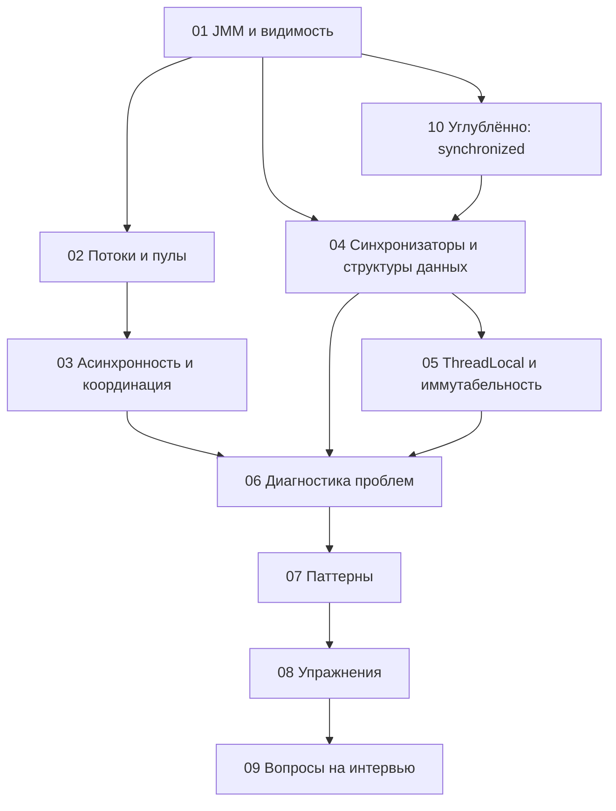

---
---

# Multithreading: структура материала

## Содержание

1. [Актуальность материала](#актуальность-материала)
2. [Историческая справка](#историческая-справка)
3. [Дорожная карта глав](#дорожная-карта-глав)
4. [Как главы связаны между собой](#как-главы-связаны-между-собой)
5. [Рекомендации по изучению](#рекомендации-по-изучению)

## Актуальность материала

- **Дата проверки:** 2026-08-04
- **Целевая версия или диапазон:** Java SE 17–25; preview-возможности рассматриваются только там, где явно помечены
- **Статус примеров:** `current`
- **Первичные источники:** [OpenJDK documentation](https://openjdk.org/); [Oracle Java SE Specifications](https://docs.oracle.com/javase/specs/)

## Историческая справка

Java изначально проектировалась как язык с встроенной поддержкой многопоточности. В Java 1.0 (1996) появились классы `Thread`, `Runnable` и ключевое слово `synchronized`. Это был значительный шаг вперёд по сравнению с C/C++, где многопоточность зависела от платформы.

**Основные вехи эволюции:**
- **Java 1.0-1.4**: Базовые примитивы (`Thread`, `synchronized`, `wait/notify`). Модель памяти имела серьёзные недостатки.
- **Java 5 (2004)**: Революционное обновление — появился пакет `java.util.concurrent` (JSR-166) от Doug Lea. Добавлены `ExecutorService`, `Lock`, `Semaphore`, `CountDownLatch`, `ConcurrentHashMap`, атомарные классы. Переработана Java Memory Model (JSR-133).
- **Java 7 (2011)**: `ForkJoinPool` и `RecursiveTask` для параллельных вычислений.
- **Java 8 (2014)**: `CompletableFuture` для асинхронного программирования, параллельные стримы.
- **Java 9-17**: Улучшения `CompletableFuture`, reactive streams (Flow API), оптимизации `ConcurrentHashMap`.
- **Java 19-21 (2023)**: Виртуальные потоки (Project Loom), structured concurrency — революция в асинхронном программировании.

## Дорожная карта глав

1. [Java Memory Model и гарантии видимости](multithreading/01-jmm-visibility.html) — модель памяти JVM, happens-before, volatile и проблемы синхронизации.
2. [Управление потоками и пулами](multithreading/02-thread-pools.html) — ExecutorService, ForkJoinPool, виртуальные потоки, управление жизненным циклом.
3. [Асинхронные вычисления и координация](multithreading/03-async-coordination.html) — CompletableFuture, Structured Concurrency, построение асинхронных конвейеров.
4. [Синхронизаторы и конкурентные структуры данных](multithreading/04-synchronizers.html) — Lock, ReadWriteLock, StampedLock, CountDownLatch, CyclicBarrier, Semaphore, Phaser, атомарные типы, ConcurrentHashMap, BlockingQueue.
5. [Потоковое локальное состояние и неизменяемость](multithreading/05-threadlocal-immutability.html) — ThreadLocal, InheritableThreadLocal, неизменяемые объекты, Records.
6. [Диагностика и устранение проблем](multithreading/06-diagnostics-problems.html) — deadlock, livelock, starvation, race conditions, инструменты диагностики (jstack, jcmd, JFR), тестирование конкурентного кода.
7. [Шаблоны и практические приёмы](multithreading/07-patterns.html) — Producer-Consumer, Worker Pool, Fork/Join, Reactive Streams, Double-Checked Locking, Thread-Per-Message, параллельные коллекции.
8. [Практические упражнения](multithreading/08-exercises.html) — задачи для закрепления материала с подсказками по реализации.
9. [Вопросы на собеседовании](multithreading/09-interview-questions.html) — типичные вопросы с детальными ответами и примерами кода.
10. [Synchronized: теория и практика](multithreading/10-synchronized.html) — углублённый разбор мониторов, happens-before, `wait`/`notify`, устройства и производительности `synchronized`.

## Как главы связаны между собой

Ниже схема показывает рекомендуемую последовательность изучения и то, как блоки зависимы друг от друга:

Глава 10 имеет последний номер, потому что добавлена как самостоятельное углубление, но логически её лучше читать после основ JMM и до обзора высокоуровневых синхронизаторов.

Для командной работы и production-задач полезно также мыслить «слоями ответственности»:

## Рекомендации по изучению

1. **Начните с основ**: Изучите Java Memory Model и понимание happens-before — это фундамент для рассуждения о корректности многопоточного кода.
2. **Практикуйте постепенно**: Начните с простых ExecutorService, затем переходите к более сложным конструкциям вроде CompletableFuture и Fork/Join.
3. **Изучайте паттерны**: Понимание типичных паттернов (Producer-Consumer, Worker Pool) поможет быстро находить решения.
4. **Диагностируйте проблемы**: Научитесь выявлять и устранять deadlock, race conditions и другие проблемы конкуренции.
5. **Решайте упражнения**: Практические задания помогут закрепить теорию и понять нюансы реализации.
6. **Готовьтесь к собеседованиям**: Используйте раздел вопросов для самопроверки и повторения ключевых тем.

> **Современная многопоточность.** Виртуальные потоки были preview в JDK 19–20 и стали final в JDK 21. Structured Concurrency имеет другую матрицу: JDK 19–20 — **incubator** (JEP 428/437), JDK 21–24 — первый–четвёртый **preview** (JEP 453/462/480/499), JDK 25 — пятый **preview** с переработанным API (JEP 505), JDK 26 — шестой **preview** (JEP 525); final-релиза API пока нет. Для preview-примеров указывайте точный компилятор и флаги, например JDK 24: `javac --release 24 --enable-preview Example.java` и `java --enable-preview Example`. Preview API может измениться или исчезнуть, поэтому в production нужны закреплённый toolchain, тесты обновления и план миграции. Изучайте как классические подходы, так и современные возможности платформы.
