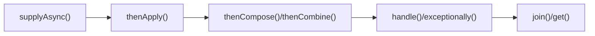
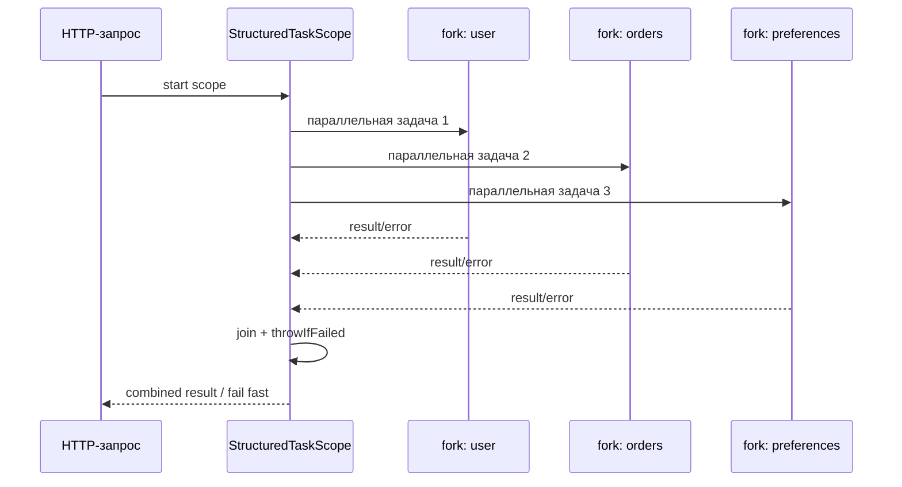
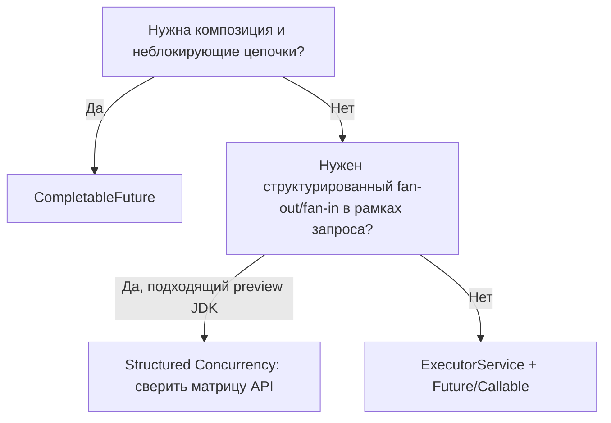

---
---

# Асинхронные вычисления и координация

## Содержание

1. [Актуальность материала](#актуальность-материала)
2. [CompletableFuture: асинхронные конвейеры](#completablefuture-асинхронные-конвейеры)
3. [Structured Concurrency: матрица JDK](#structured-concurrency-матрица-jdk)
4. [Future и его ограничения](#future-и-его-ограничения)
5. [Как выбирать подход](#как-выбирать-подход)

<script type="module" src="../../assets/mermaid-init.js"></script>

## Актуальность материала

- **Дата проверки:** 2026-08-04
- **Целевая версия или диапазон:** Java SE 17–25; preview-возможности рассматриваются только там, где явно помечены
- **Статус примеров:** `current`
- **Первичные источники:** [OpenJDK documentation](https://openjdk.org/); [Oracle Java SE Specifications](https://docs.oracle.com/javase/specs/)

## CompletableFuture: асинхронные конвейеры

`CompletableFuture` (Java 8+) предоставляет мощный API для построения асинхронных вычислений:



**Базовое создание и получение результата:**

```java
// Асинхронное выполнение
CompletableFuture<String> future = CompletableFuture.supplyAsync(() -> {
    // Выполняется в ForkJoinPool.commonPool()
    sleep(1000);
    return "Result from async computation";
});

// Получение результата (блокирующая операция)
String result = future.get(); // Бросает ExecutionException, InterruptedException

// Получение с таймаутом (Java 9+)
String resultWithTimeout = future.get(5, TimeUnit.SECONDS); // TimeoutException

// Неблокирующее получение
String resultNow = future.getNow("default value"); // Вернёт default, если не готово
```

**Цепочки трансформаций:**

```java
CompletableFuture<String> result = CompletableFuture
    .supplyAsync(() -> {
        // Первая асинхронная операция
        return fetchUserId();
    })
    .thenApply(userId -> {
        // Синхронная трансформация (выполняется в том же потоке)
        return "User-" + userId;
    })
    .thenApplyAsync(userName -> {
        // Асинхронная трансформация (новый поток из пула)
        return fetchUserDetails(userName);
    })
    .thenApply(userDetails -> {
        return userDetails.toJson();
    });
```

**Обработка ошибок:**

```java
CompletableFuture<String> future = CompletableFuture
    .supplyAsync(() -> {
        if (Math.random() > 0.5) {
            throw new RuntimeException("Random failure");
        }
        return "Success";
    })
    .exceptionally(ex -> {
        // Обработка исключения, возврат значения по умолчанию
        System.err.println("Error: " + ex.getMessage());
        return "Fallback value";
    })
    .handle((result, ex) -> {
        // Обработка как успеха, так и ошибки
        if (ex != null) {
            return "Error: " + ex.getMessage();
        }
        return "Success: " + result;
    });
```

**Комбинирование нескольких futures:**

```java
// Параллельное выполнение независимых задач
CompletableFuture<String> future1 = CompletableFuture.supplyAsync(() -> {
    sleep(1000);
    return "Result1";
});

CompletableFuture<String> future2 = CompletableFuture.supplyAsync(() -> {
    sleep(1000);
    return "Result2";
});

// Комбинирование двух результатов
CompletableFuture<String> combined = future1.thenCombine(future2, (r1, r2) -> {
    return r1 + " + " + r2;
});

// Ожидание всех futures
CompletableFuture<Void> allOf = CompletableFuture.allOf(future1, future2);
allOf.thenRun(() -> {
    System.out.println("All tasks completed");
});

// Ожидание первого завершённого future
CompletableFuture<Object> anyOf = CompletableFuture.anyOf(future1, future2);
anyOf.thenAccept(result -> {
    System.out.println("First completed: " + result);
});
```

**Практический пример: параллельные HTTP запросы**

```java
public class AsyncHttpService {
    private final ExecutorService executor = Executors.newFixedThreadPool(10);
    
    public CompletableFuture<List<String>> fetchAllUserData(List<String> userIds) {
        List<CompletableFuture<String>> futures = userIds.stream()
            .map(userId -> CompletableFuture.supplyAsync(() -> {
                return httpClient.get("/users/" + userId);
            }, executor))
            .collect(Collectors.toList());
        
        // Ожидаем все запросы и собираем результаты
        return CompletableFuture.allOf(futures.toArray(new CompletableFuture[0]))
            .thenApply(v -> futures.stream()
                .map(CompletableFuture::join) // join не бросает checked exceptions
                .collect(Collectors.toList()));
    }
    
    public CompletableFuture<String> fetchWithTimeout(String url, Duration timeout) {
        CompletableFuture<String> future = CompletableFuture.supplyAsync(() -> {
            return httpClient.get(url);
        }, executor);
        
        // Timeout с Java 9+
        return future.orTimeout(timeout.toMillis(), TimeUnit.MILLISECONDS)
            .exceptionally(ex -> {
                if (ex instanceof TimeoutException) {
                    return "Request timed out";
                }
                return "Error: " + ex.getMessage();
            });
    }
}
```

## Structured Concurrency: матрица JDK

| JDK | JEP и статус возможности | Совместимость API |
|---|---|---|
| 19 | JEP 428, **incubator** | Первая инкубация. |
| 20 | JEP 437, второй **incubator** | Инкубационный API. |
| 21 | JEP 453, первый **preview** | Нужен preview-режим. |
| 22 | JEP 462, второй **preview** | Нужен preview-режим. |
| 23 | JEP 480, третий **preview** | Нужен preview-режим. |
| 24 | JEP 499, четвёртый **preview** | Последняя версия API с `StructuredTaskScope.ShutdownOnFailure`. |
| 25 | JEP 505, пятый **preview** | API переработан вокруг `StructuredTaskScope.open(...)` и `Joiner`; примеры для JDK 24 требуют переписывания. |
| 26 | JEP 525, шестой **preview** | Всё ещё не final API; нужен preview-режим. |

Пример ниже написан **точно для компилятора JDK 24**. Компиляция: `javac --release 24 --enable-preview Example.java`; запуск: `java --enable-preview Example`. Preview API может измениться или исчезнуть, требует той же версии runtime, что и компилятор, и не рекомендуется как стабильная production-зависимость без плана миграции, закреплённого toolchain и тестирования на каждом обновлении JDK.

Structured concurrency упрощает управление группами задач:



```java
import java.util.concurrent.StructuredTaskScope;

public String fetchUserData(String userId) throws Exception {
    // Все задачи в scope автоматически отменяются при выходе
    try (var scope = new StructuredTaskScope.ShutdownOnFailure()) {
        
        // Запускаем несколько параллельных задач
        StructuredTaskScope.Subtask<String> user = scope.fork(() -> fetchUser(userId));
        StructuredTaskScope.Subtask<String> orders = scope.fork(() -> fetchOrders(userId));
        StructuredTaskScope.Subtask<String> preferences = scope.fork(() -> fetchPreferences(userId));
        
        // Ждём завершения всех или первой ошибки
        scope.join();
        scope.throwIfFailed(); // Бросает исключение, если была ошибка
        
        // Все задачи успешно завершены
        return combineResults(
            user.get(),
            orders.get(),
            preferences.get()
        );
    } // Автоматическая очистка и отмена незавершённых задач
}

// ShutdownOnSuccess - завершается при первом успехе
public String fetchFromMultipleSources(List<String> urls) throws Exception {
    try (var scope = new StructuredTaskScope.ShutdownOnSuccess<String>()) {
        for (String url : urls) {
            scope.fork(() -> httpClient.get(url));
        }
        
        scope.join();
        return scope.result(); // Первый успешный результат
    }
}
```

## Future и его ограничения

До `CompletableFuture` существовал интерфейс `Future` с серьёзными ограничениями:

```java
ExecutorService executor = Executors.newFixedThreadPool(2);

// Старый подход с Future
Future<String> future = executor.submit(() -> {
    Thread.sleep(1000);
    return "Result";
});

// Проблемы Future:
// 1. Блокирующее ожидание
String result = future.get(); // Блокирует поток!

// 2. Нет комбинирования
Future<String> f1 = executor.submit(() -> "A");
Future<String> f2 = executor.submit(() -> "B");
// Нет способа объединить f1 и f2 без блокировки

// 3. Нет обработки ошибок
try {
    result = future.get();
} catch (ExecutionException e) {
    // Приходится ловить исключения вручную
}

// 4. Нет отмены с callback
future.cancel(true); // Отменяет, но нет способа узнать об этом асинхронно
```

## Как выбирать подход


