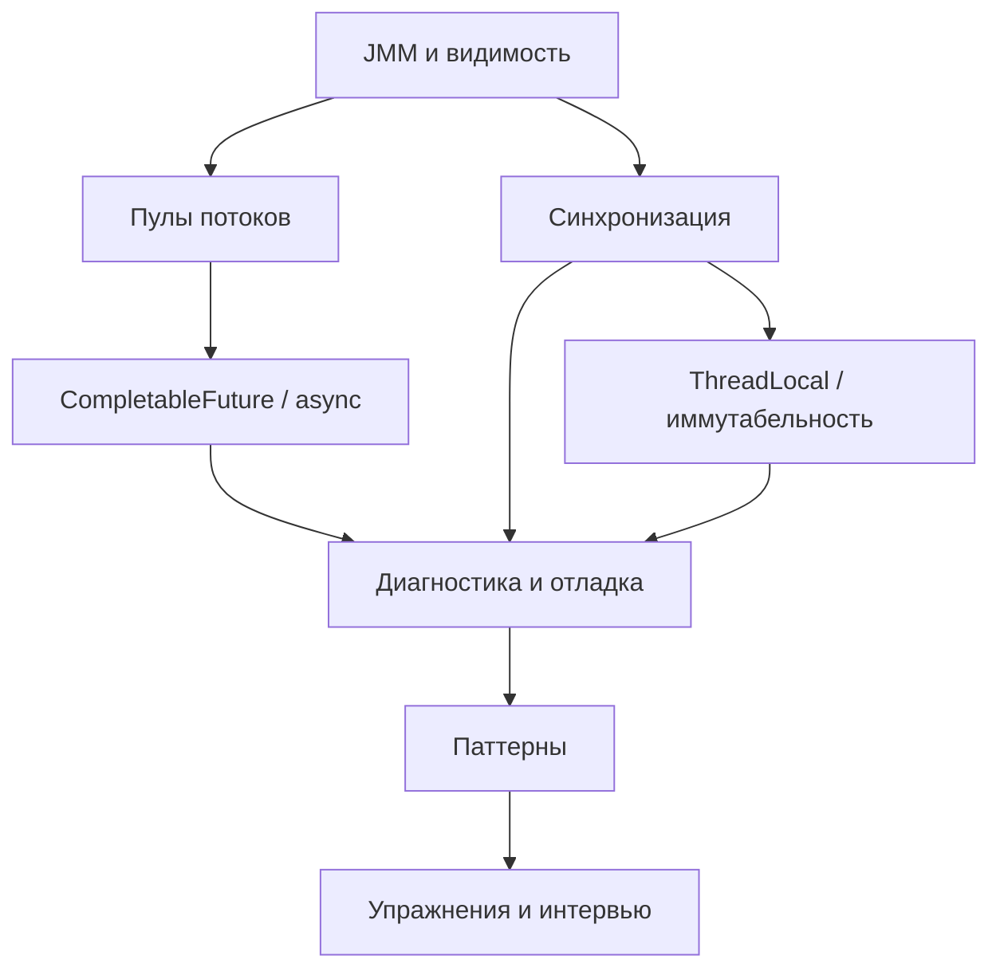

# Multithreading

Многопоточность в Java: модель памяти, синхронизация, конкурентные библиотеки, паттерны и практические приёмы.

## 📚 Содержание

1. [Java Memory Model и гарантии видимости](01-jmm-visibility.md)
   - Модель памяти Java
   - Happens-before
   - Volatile и synchronized
   - Проблемы видимости

2. [Управление потоками и пулами](02-thread-pools.md)
   - Thread и Runnable
   - ExecutorService
   - ThreadPoolExecutor
   - ForkJoinPool

3. [Асинхронные вычисления и координация](03-async-coordination.md)
   - CompletableFuture
   - Future и Callable
   - Асинхронные паттерны
   - Обработка ошибок

4. [Синхронизаторы и конкурентные структуры данных](04-synchronizers.md)
   - CountDownLatch, CyclicBarrier
   - Semaphore, Phaser
   - ConcurrentHashMap
   - Другие конкурентные коллекции

5. [Потоковое локальное состояние и неизменяемость](05-threadlocal-immutability.md)
   - ThreadLocal
   - Неизменяемые объекты
   - Безопасная публикация
   - Final поля

6. [Диагностика и устранение проблем](06-diagnostics-problems.md)
   - Deadlock
   - Race conditions
   - Starvation и livelock
   - Инструменты диагностики

7. [Шаблоны и практические приёмы](07-patterns.md)
   - Producer-Consumer
   - Read-Write Lock
   - Double-checked locking
   - Другие паттерны

8. [Практические упражнения](08-exercises.md)
   - Задачи на многопоточность
   - Разбор решений
   - Типичные ошибки

9. [Вопросы на собеседовании](09-interview-questions.md)
   - Теоретические вопросы
   - Практические задачи
   - Анализ кода
   - Советы по подготовке

10. [Synchronized: теория и практика](10-synchronized.md)
   - Основные концепции (мониторы, взаимное исключение, видимость)
   - Синтаксис и формы использования
   - Семантика happens-before
   - Реентерабельность
   - Взаимодействие с wait/notify/notifyAll
   - Внутреннее устройство и оптимизации JVM
   - Производительность и сравнение с другими механизмами
   - Best practices и типичные ошибки
   - Практические примеры

## 🗺️ Визуальная карта раздела

## 🎯 Как использовать

### Для начинающих
Начните с Java Memory Model и базовых концепций синхронизации. Это фундамент для понимания многопоточности.

### Для подготовки к собеседованиям
Сосредоточьтесь на файлах с упражнениями и вопросами. Разберите типичные проблемы и их решения.

### Для опытных разработчиков
Изучите продвинутые паттерны и инструменты диагностики. Обратите внимание на современные API вроде CompletableFuture.

## 💡 Рекомендации

- Обязательно поймите Java Memory Model — без этого невозможна правильная многопоточность
- Предпочитайте высокоуровневые абстракции (ExecutorService, CompletableFuture) низкоуровневым (Thread, synchronized)
- Используйте конкурентные коллекции вместо синхронизированных обёрток
- Тестируйте многопоточный код с инструментами вроде jcstress
- Профилируйте производительность — не оптимизируйте преждевременно

## ⚠️ Важные замечания

> **Многопоточность сложна**: Даже опытные разработчики делают ошибки. Используйте проверенные библиотеки и паттерны.

> **Видимость ≠ Атомарность**: volatile обеспечивает видимость, но не гарантирует атомарность операций.

> **Иммутабельность — ваш друг**: Неизменяемые объекты автоматически thread-safe.

---

[← Назад к разделу Java](../README.md)
