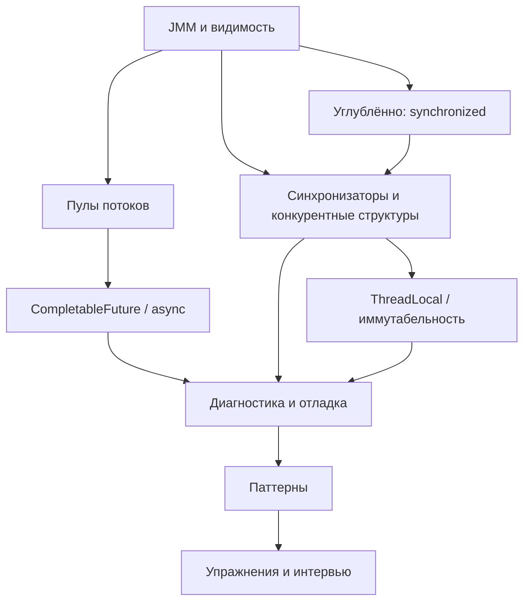

---
---

# Multithreading

## Содержание

1. [📚 Содержание](#-содержание)
2. [🗺️ Визуальная карта раздела](#-визуальная-карта-раздела)
3. [🎯 Как использовать](#-как-использовать)
   - [Для начинающих](#для-начинающих)
   - [Для подготовки к собеседованиям](#для-подготовки-к-собеседованиям)
   - [Для опытных разработчиков](#для-опытных-разработчиков)
4. [💡 Рекомендации](#-рекомендации)
5. [⚠️ Важные замечания](#-важные-замечания)

[Краткая навигация раздела](../02-multithreading.html)

Многопоточность в Java: модель памяти, синхронизация, конкурентные библиотеки, паттерны и практические приёмы.

> Эта страница — подробное оглавление раздела, обзор которого находится в
> [`02-multithreading.md`](../02-multithreading.html). Ссылки ниже ведут на отдельные
> главы единого учебного маршрута.

## 📚 Содержание

1. [Java Memory Model и гарантии видимости](01-jmm-visibility.html)
   - Модель памяти Java
   - Happens-before
   - Volatile и synchronized
   - Проблемы видимости

2. [Управление потоками и пулами](02-thread-pools.html)
   - Thread и Runnable
   - ExecutorService
   - ThreadPoolExecutor
   - ForkJoinPool

3. [Асинхронные вычисления и координация](03-async-coordination.html)
   - CompletableFuture
   - Future и Callable
   - Асинхронные паттерны
   - Обработка ошибок

4. [Синхронизаторы и конкурентные структуры данных](04-synchronizers.html)
   - CountDownLatch, CyclicBarrier
   - Semaphore, Phaser
   - ConcurrentHashMap
   - Другие конкурентные коллекции

5. [Потоковое локальное состояние и неизменяемость](05-threadlocal-immutability.html)
   - ThreadLocal
   - Неизменяемые объекты
   - Безопасная публикация
   - Final поля

6. [Диагностика и устранение проблем](06-diagnostics-problems.html)
   - Deadlock
   - Race conditions
   - Starvation и livelock
   - Инструменты диагностики

7. [Шаблоны и практические приёмы](07-patterns.html)
   - Producer-Consumer
   - Read-Write Lock
   - Double-checked locking
   - Другие паттерны

8. [Практические упражнения](08-exercises.html)
   - Задачи на многопоточность
   - Разбор решений
   - Типичные ошибки

9. [Вопросы на собеседовании](09-interview-questions.html)
   - Теоретические вопросы
   - Практические задачи
   - Анализ кода
   - Советы по подготовке

10. [Synchronized: теория и практика](10-synchronized.html)
   - Основные концепции (мониторы, взаимное исключение, видимость)
   - Синтаксис и формы использования
   - Семантика happens-before
   - Реентерабельность
   - Взаимодействие с wait/notify/notifyAll
   - Внутреннее устройство и оптимизации JVM
   - Производительность и сравнение с другими механизмами
   - Best practices и типичные ошибки
   - Практические примеры

## 🗺️ Визуальная карта раздела

```mermaid
flowchart TD
    A["JMM и видимость"] --> B["Пулы потоков"]
    A --> S["Углублённо: synchronized"]
    A --> C["Синхронизаторы и конкурентные структуры"]
    S --> C
    B --> D["CompletableFuture / async"]
    C --> E["ThreadLocal / иммутабельность"]
    D --> F["Диагностика и отладка"]
    C --> F
    E --> F
    F --> G["Паттерны"]
    G --> H["Упражнения и интервью"]
```

## 🎯 Как использовать

### Для начинающих
Начните с Java Memory Model, затем прочитайте главу про `synchronized` и переходите к пулам потоков и высокоуровневым синхронизаторам. Несмотря на номер 10, глава про `synchronized` расположена в этой точке маршрута как углубление базовых механизмов.

### Для подготовки к собеседованиям
Сосредоточьтесь на файлах с упражнениями и вопросами. Разберите типичные проблемы и их решения.

### Для опытных разработчиков
Изучите продвинутые паттерны и инструменты диагностики. Обратите внимание на современные API вроде CompletableFuture.

## 💡 Рекомендации

- Обязательно поймите Java Memory Model — без этого невозможна правильная многопоточность
- Предпочитайте высокоуровневые абстракции (ExecutorService, CompletableFuture) низкоуровневым (Thread, synchronized)
- Используйте конкурентные коллекции вместо синхронизированных обёрток
- Тестируйте многопоточный код с инструментами вроде jcstress
- Профилируйте производительность — не оптимизируйте преждевременно

## ⚠️ Важные замечания

> **Многопоточность сложна**: Даже опытные разработчики делают ошибки. Используйте проверенные библиотеки и паттерны.

> **Видимость ≠ Атомарность**: volatile обеспечивает видимость, но не гарантирует атомарность операций.

> **Иммутабельность — ваш друг**: Неизменяемые объекты автоматически thread-safe.

---

[← Назад к разделу Java](../README.html)
