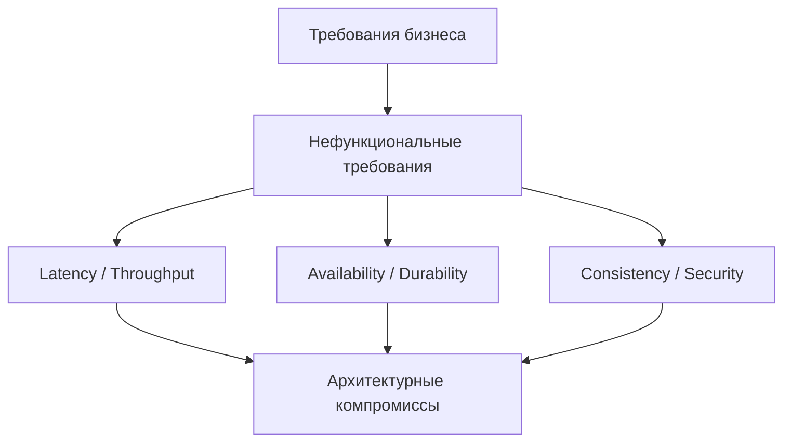

# Основы и архитектурные компромиссы

## Содержание

1. [Зачем нужен system design](#зачем-нужен-system-design)
2. [Нефункциональные требования](#нефункциональные-требования)
3. [Основные компромиссы](#основные-компромиссы)
   - [Latency vs throughput](#latency-vs-throughput)
   - [Consistency vs availability](#consistency-vs-availability)
   - [Стоимость vs сложность](#стоимость-vs-сложность)
4. [CAP, PACELC и practical thinking](#cap-pacelc-и-practical-thinking)
5. [Оценка нагрузки и capacity planning](#оценка-нагрузки-и-capacity-planning)
6. [Надёжность через SLA, SLO и error budget](#надёжность-через-sla-slo-и-error-budget)
7. [Практический алгоритм разбора задачи](#практический-алгоритм-разбора-задачи)
8. [Вопросы для самопроверки](#вопросы-для-самопроверки)

## Зачем нужен system design

**System design** — это дисциплина проектирования систем с учётом нагрузки, надёжности, стоимости, развития и ограничений команды. На практике она нужна не только архитекторам: backend-разработчик ежедневно принимает design-решения, когда выбирает модель данных, способ интеграции, схему кэширования или стратегию ретраев.

Хороший design отвечает не на вопрос «какие технологии модные», а на вопрос «как система будет вести себя при росте нагрузки, отказах и изменении требований». Поэтому обсуждение почти всегда начинается с требований и ограничений.

## Нефункциональные требования

В system design важно быстро зафиксировать нефункциональные требования:

- **Нагрузка**: сколько RPS, сколько активных пользователей, какой объём данных.
- **Latency**: какое время ответа ожидает пользователь.
- **Availability**: допустим ли простой и как долго.
- **Durability**: можно ли потерять данные и в каком объёме.
- **Consistency**: должны ли все клиенты видеть одинаковое состояние немедленно.
- **Security/compliance**: есть ли требования по шифрованию, аудиту, персональным данным.
- **Cost constraints**: насколько дорогие решения допустимы.

Если требований нет, их нужно явно сформулировать как assumptions. На интервью это особенно важно: вы показываете зрелость мышления и уменьшаете число «магических» решений.

## Основные компромиссы

### Latency vs throughput

Система может обрабатывать очень много запросов в секунду, но при этом иметь высокий хвост задержек (p95/p99). И наоборот — можно держать низкую среднюю latency при умеренной нагрузке.

Типичные рычаги управления:

- batching повышает throughput, но увеличивает задержку отдельных операций;
- кэш уменьшает latency чтения, но усложняет invalidation;
- асинхронная обработка снимает нагрузку с request path, но добавляет eventual consistency.

### Consistency vs availability

В распределённых системах при сетевом разделении нельзя одновременно гарантировать и полную доступность, и строгую согласованность для всех операций. Поэтому важно выделять:

- какие операции критичны к точности прямо сейчас;
- где допустима **eventual consistency**;
- что хуже для бизнеса: отказ операции или временно устаревшие данные.

### Стоимость vs сложность

Сложная архитектура нередко технически «правильнее», но экономически хуже:

- multi-region повышает доступность, но дорог в эксплуатации;
- микросервисы дают автономность команд, но резко увеличивают интеграционную сложность;
- шардирование убирает лимиты одной БД, но усложняет запросы и операционку.

## CAP, PACELC и practical thinking

**CAP** напоминает: при сетевом partition приходится выбирать приоритет между consistency и availability.

- **CP-системы** предпочитают консистентность, даже если часть запросов будет недоступна.
- **AP-системы** предпочитают доступность, соглашаясь на временное расхождение данных.

**PACELC** расширяет CAP: даже когда partition нет, система всё равно выбирает между latency и consistency. Это полезно для практики, потому что большинство рабочих компромиссов происходят именно в нормальном режиме, а не только при аварии.

> **Важно**: CAP не означает, что нужно выбрать один режим «на всю систему». Часто разные операции имеют разные гарантии. Например, каталог товаров может быть eventual consistent, а платёж — гораздо строже.

## Оценка нагрузки и capacity planning

Перед выбором архитектуры полезно прикинуть порядок величин.

| Метрика | Что оценить | Зачем это нужно |
|---------|-------------|-----------------|
| RPS/QPS | средняя и пиковая нагрузка | выбор числа инстансов и сетевого контура |
| Data size | сколько данных хранится и как быстро растёт | выбор storage и политики retention |
| Read/Write ratio | доля чтений и записей | выбор кэша, реплик, модели БД |
| Object size | средний размер записи/сообщения | расчёт сети, диска, брокера |
| Peak factor | во сколько раз пик выше среднего | проектирование под burst-нагрузку |

Простой шаблон расчёта:

1. оцените пользователей в день и долю активных одновременно;
2. переведите пользовательские действия в операции системы;
3. добавьте пиковый коэффициент и запас на рост;
4. выделите самые тяжёлые ресурсы: CPU, память, сеть, диск, соединения.

## Надёжность через SLA, SLO и error budget

- **SLA** — договорное обещание доступности/качества сервиса.
- **SLO** — внутренняя цель, например 99.9% успешных запросов за 30 дней.
- **SLI** — измерение, которым считается достижение цели.
- **Error budget** — допустимый объём ошибок/недоступности до нарушения SLO.

Эти понятия помогают не спорить абстрактно о «надёжности», а принимать решения:

- можно ли выкатывать рискованную фичу;
- пора ли остановить релизы и заняться стабилизацией;
- оправдано ли удорожание архитектуры ради ещё одной «девятки» доступности.

## Практический алгоритм разбора задачи

1. **Уточните требования**: функциональные и нефункциональные.
2. **Оцените масштаб**: пользователи, RPS, данные, пики.
3. **Нарисуйте high-level architecture**: клиент, API, storage, async processing, cache.
4. **Найдите bottleneck и single points of failure**.
5. **Проговорите компромиссы**: почему именно такая БД, кэш, брокер, консистентность.
6. **Добавьте observability и operations**: метрики, алерты, rollout strategy.
7. **Подумайте про evolution path**: что изменится при росте в 10 раз.

## Вопросы для самопроверки

1. Почему обсуждение system design нельзя начинать с выбора технологии?
2. Чем p99 latency полезнее, чем среднее время ответа?
3. Как CAP влияет на пользовательские операции в реальном продукте?
4. Когда eventual consistency лучше строгой консистентности?
5. Что изменится в дизайне, если требование по availability вырастет с 99.9% до 99.99%?
