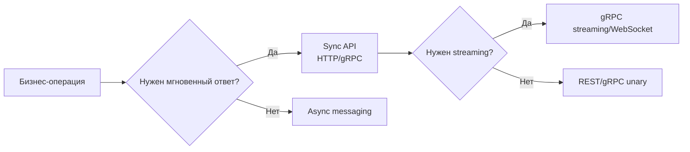

# Сетевое взаимодействие и API

## Содержание

1. [Как выбирать способ взаимодействия](#как-выбирать-способ-взаимодействия)
2. [HTTP, gRPC, WebSocket и async messaging](#http-grpc-websocket-и-async-messaging)
3. [Проектирование API-контрактов](#проектирование-api-контрактов)
4. [Polling, webhooks и push-модели](#polling-webhooks-и-push-модели)
5. [Таймауты, ретраи и идемпотентность](#таймауты-ретраи-и-идемпотентность)
6. [Load balancer, reverse proxy и API gateway](#load-balancer-reverse-proxy-и-api-gateway)
7. [Rate limiting и versioning](#rate-limiting-и-versioning)
8. [Паттерны устойчивого взаимодействия](#паттерны-устойчивого-взаимодействия)
9. [Типичные ошибки](#типичные-ошибки)
10. [Вопросы для самопроверки](#вопросы-для-самопроверки)

## Как выбирать способ взаимодействия

Способ коммуникации определяется не модой, а свойствами бизнес-операции:

- нужен ли мгновенный ответ пользователю;
- важна ли жёсткая контрактность и типизация;
- допустима ли асинхронная обработка;
- нужно ли server push или long-lived connection;
- как часто и кем будет вызываться интерфейс.

Хорошее правило: **синхронный вызов** выбирают, когда результат нужен прямо сейчас, а **асинхронный** — когда важнее развязать компоненты и сгладить нагрузку.

## HTTP, gRPC, WebSocket и async messaging

| Подход | Когда подходит | Сильные стороны | Ограничения |
|--------|----------------|-----------------|-------------|
| HTTP/REST | публичные API, CRUD, простая интеграция | универсальность, понятность, кеширование, tooling | overfetching, текстовый формат, ограниченность real-time |
| gRPC | внутренние сервисы, низкая latency, строгие контракты | protobuf, streaming, code generation | хуже подходит как публичный браузерный API |
| WebSocket | чат, live updates, trading, presence | двусторонняя real-time связь | сложнее масштабировать и дебажить |
| Async messaging | фоновые задачи, интеграция, high decoupling | буферизация, ретраи, независимость сервисов | eventual consistency, сложнее трассировать поток |

На практике редко бывает один протокол на всю систему. Например:

- клиент → backend по HTTP;
- backend → backend по gRPC;
- backend → worker через брокер сообщений;
- уведомления клиенту по WebSocket или SSE.

## Проектирование API-контрактов

При проектировании API полезно заранее определить:

- **resource model**: какие сущности есть и как они связаны;
- **операции**: CRUD, команды, bulk actions;
- **ошибки**: какой код и какое тело ответа получает клиент;
- **pagination/filtering/sorting** для списков;
- **idempotency strategy** для повторных запросов;
- **backward compatibility** при эволюции контракта.

Рекомендации:

- используйте предсказуемые и стабильные имена ресурсов;
- разделяйте внешнюю модель API и внутреннюю модель домена;
- не протаскивайте database schema наружу;
- документируйте ограничения: rate limits, размер payload, SLA.

## Polling, webhooks и push-модели

Не вся интеграция сводится к обычному request/response. Полезно различать:

- **Polling** — клиент периодически сам спрашивает, появились ли обновления.
- **Long polling** — клиент держит запрос открытым дольше, пока сервер не вернёт событие или timeout.
- **Webhooks** — сервер сам отправляет событие во внешний endpoint потребителя.
- **SSE/WebSocket** — сервер может пушить обновления по уже открытому соединению.

Выбор зависит от сценария:

- polling прост в реализации, но дорог при большом числе клиентов и редких изменениях;
- webhooks хорошо подходят для B2B-интеграций и событий «по факту»;
- SSE/WebSocket оправданы, когда нужен near-real-time UX;
- long polling — компромисс, когда полноценный persistent channel избыточен.

При webhooks особенно важны:

- подпись запроса и проверка подлинности отправителя;
- retry policy со стороны отправителя;
- идемпотентность и deduplication у получателя;
- observability для доставки и недоставленных событий.

## Таймауты, ретраи и идемпотентность

Сетевые сбои — норма, а не исключение. Поэтому любой межсервисный вызов должен иметь:

- **таймаут** — чтобы не зависать бесконечно;
- **retry policy** — но только для безопасных или идемпотентных операций;
- **backoff + jitter** — чтобы не устроить thundering herd;
- **idempotency key** — для повторной отправки команд вроде создания платежа или заказа.

> **Важно**: без идемпотентности ретраи опасны. Если клиент повторит команду `create payment`, можно случайно создать две операции вместо одной.

## Load balancer, reverse proxy и API gateway

Эти компоненты часто путают, хотя задачи у них разные:

- **Load balancer** распределяет трафик между несколькими инстансами или регионами.
- **Reverse proxy** стоит перед backend-сервисами и может делать TLS termination, routing, caching, compression.
- **API gateway** управляет входом в API-контур: auth, rate limits, quotas, policy enforcement, aggregation.

В реальной системе они нередко стоят вместе, а не вместо друг друга. Например: внешний load balancer принимает трафик, reverse proxy терминирует TLS и маршрутизирует, а API gateway применяет продуктовые политики доступа.

> **Важно**: API gateway не должен превращаться в «god component», в котором живёт половина бизнес-логики системы.

## Rate limiting и versioning

**Rate limiting** защищает систему от перегрузки и злоупотреблений. Частые алгоритмы:

- token bucket;
- leaky bucket;
- fixed window;
- sliding window log/counter.

**Versioning** стоит вводить аккуратно. Если можно поддерживать обратную совместимость без новой версии — это часто лучше. Но для радикальных изменений версионирование API спасает клиентов от неожиданных поломок.

## Паттерны устойчивого взаимодействия

- **Circuit breaker** — прекращает бить в умирающую зависимость.
- **Bulkhead** — изолирует ресурсы между типами операций.
- **Request hedging** — повторный запрос к другой реплике при подозрительно долгом ответе.
- **Retry with backoff** — повтор только там, где он безопасен.
- **Deadlines propagation** — общий бюджет времени прокидывается по цепочке вызовов.

Хороший дизайн взаимодействия учитывает всю цепочку, а не только отдельный endpoint. Иначе можно сделать быстрый сервис, который всё равно ломается из-за соседей.

## Типичные ошибки

- отсутствие таймаутов в HTTP/gRPC клиентах;
- агрессивные ретраи без jitter;
- слишком chatty API между сервисами;
- крупные payload и лишние поля «на будущее»;
- смешивание публичного и внутреннего API без разграничения требований.

## Вопросы для самопроверки

1. Когда лучше использовать gRPC, а когда REST?
2. Почему ретраи без идемпотентности опасны?
3. Зачем нужен jitter в retry policy?
4. В каких сценариях WebSocket оправдан, а в каких — лишняя сложность?
5. Когда webhooks лучше polling, а когда хуже?
6. Чем load balancer отличается от reverse proxy и API gateway?
