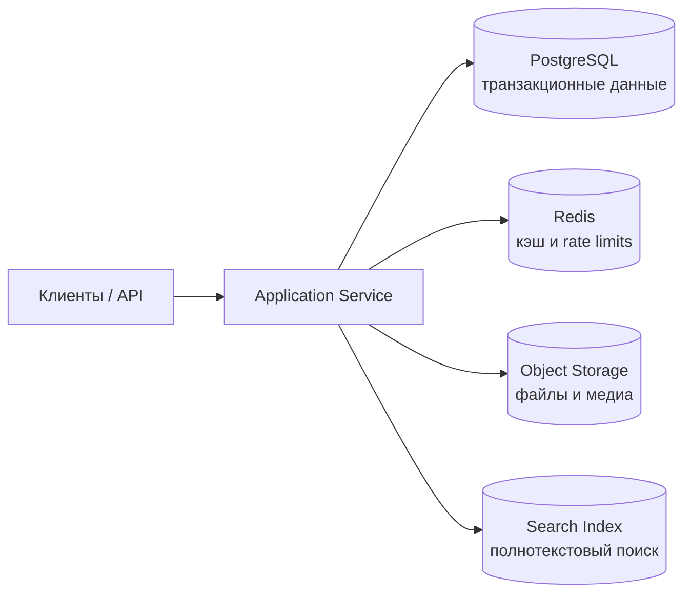

# Хранение данных и выбор базы

## Содержание

1. [Как выбирать storage](#как-выбирать-storage)
2. [SQL vs NoSQL](#sql-vs-nosql)
3. [Индексы, репликация и шардирование](#индексы-репликация-и-шардирование)
4. [Consistent hashing, object storage и специализированные хранилища](#consistent-hashing-object-storage-и-специализированные-хранилища)
5. [Транзакции, изоляция и согласованность](#транзакции-изоляция-и-согласованность)
6. [CQRS и разделение read/write нагрузки](#cqrs-и-разделение-readwrite-нагрузки)
7. [Практические рекомендации по моделированию данных](#практические-рекомендации-по-моделированию-данных)
8. [Антипаттерны](#антипаттерны)
9. [Вопросы для самопроверки](#вопросы-для-самопроверки)

## Как выбирать storage

База данных выбирается под паттерн доступа к данным, а не под абстрактную «современность». Полезно ответить на вопросы:

- данные больше читаются или записываются;
- важны ли join и сложные ad-hoc запросы;
- есть ли строгие транзакции между несколькими сущностями;
- каков объём данных и темп роста;
- нужно ли глобальное распределение по регионам;
- насколько допустима eventual consistency.

Часто в одной системе используется несколько видов storage: реляционная БД для транзакционных данных, Redis для кэша, object storage для файлов, search engine для полнотекстового поиска.

### Пример polyglot persistence

Такой дизайн полезен, когда у разных типов данных и запросов слишком разные требования к latency, консистентности и способу доступа.

## SQL vs NoSQL

| Критерий | SQL | NoSQL |
|----------|-----|-------|
| Схема | строгая, явная | часто гибкая или schema-lite |
| Транзакции | сильная сторона | зависят от конкретного продукта |
| Сложные запросы | join, aggregation, ad-hoc аналитика | часто требуют денормализации |
| Масштабирование | традиционно scale-up + read replicas | чаще проще scale-out |
| Консистентность | обычно сильнее | часто больше гибкости и eventual consistency |

SQL хорошо подходит, когда важны транзакции, целостность и богатый язык запросов. NoSQL оправдан, когда:

- структура данных меняется часто;
- нужна очень большая горизонтальная масштабируемость;
- модель доступа проста и заранее известна;
- допустима денормализация ради скорости чтения.

## Индексы, репликация и шардирование

**Индексы** ускоряют чтение, но замедляют запись и занимают память/диск. Их нужно строить под реальные запросы, а не «на всякий случай».

**Репликация** помогает:

- повысить availability;
- разгрузить primary на чтениях;
- приблизить данные к пользователям географически.

Но репликация приносит lag, а значит — риск чтения устаревших данных.

**Шардирование** делит данные по нескольким узлам и становится нужно, когда одна машина перестаёт справляться по диску, CPU или IOPS. Главная задача — выбрать shard key так, чтобы избежать горячих шардов и дисбаланса.

## Consistent hashing, object storage и специализированные хранилища

Не все данные живут в одной транзакционной БД. В system design важно понимать, когда нужны специализированные storage:

- **Object storage** — для файлов, медиа, бэкапов, архивов, больших immutable-объектов;
- **Search index** — для полнотекстового поиска и релевантности;
- **Time-series storage** — для метрик, событий телеметрии и агрегатов по времени;
- **Cache/key-value storage** — для очень быстрых чтений, ephemeral state и throttling.

При масштабировании key-value и cache-контуров часто используют **consistent hashing**. Идея в том, чтобы при добавлении или удалении узла перераспределять не все ключи, а только часть. Это уменьшает churn, упрощает rebalance и снижает вероятность массового cache miss после изменения topology.

Важно помнить, что object storage — это не «ещё одна БД». Он отлично подходит для больших бинарных объектов и дешёвого хранения, но не заменяет OLTP-базу с транзакциями и query semantics.

## Транзакции, изоляция и согласованность

Транзакция удобна внутри одной БД, но при межсервисном взаимодействии «глобальная транзакция» обычно слишком дорога или ненадёжна. Поэтому часто применяют:

- local transaction + event/outbox;
- saga orchestration/choreography;
- идемпотентную компенсацию вместо распределённого rollback.

Полезно различать:

- **read-your-writes** consistency;
- **monotonic reads**;
- **causal consistency**;
- строгую линейризуемость там, где она действительно нужна.

Также полезно понимать цену изоляции:

- более сильные уровни изоляции уменьшают аномалии чтения и записи;
- но блокировки и конфликтующие транзакции могут снижать throughput;
- hotspot-строки и «горячие аккаунты» часто упираются не в CPU, а в contention и lock waits.

Если в системе много конкурентных обновлений одних и тех же сущностей, заранее решайте, какой подход нужен: optimistic locking, pessimistic locking, очередь команд, serial execution per key или компенсационные механизмы.

## CQRS и разделение read/write нагрузки

**CQRS** имеет смысл, когда чтения и записи сильно различаются по модели или нагрузке. Примеры:

- write model хранит нормализованные данные и гарантирует инварианты;
- read model денормализована и оптимизирована под UI или отчёты.

Но CQRS не бесплатен:

- нужно поддерживать синхронизацию моделей;
- появляется eventual consistency;
- усложняется debugging и observability.

Используйте CQRS там, где есть явная выгода, а не как архитектурную моду.

## Практические рекомендации по моделированию данных

- моделируйте данные под ключевые use cases, а не под «идеальную» абстракцию;
- выделяйте hot path и оптимизируйте его отдельно;
- избегайте больших транзакций и тяжёлых блокировок в пиковом контуре;
- заранее продумывайте retention, archive и cleanup policy;
- храните audit trail там, где это важно для бизнеса и расследований.

## Антипаттерны

- выбор NoSQL только из-за слов «масштабируемость» и «microservices»;
- универсальная БД на все случаи жизни;
- избыточная денормализация без контроля консистентности;
- шардирование до появления реальной потребности;
- отсутствие стратегии миграций и schema evolution.

## Вопросы для самопроверки

1. Когда PostgreSQL лучше document database, даже в high-load системе?
2. Что даёт read replica и какой риск она приносит?
3. Почему shard key — критичное решение?
4. Когда CQRS приносит выгоду, а когда только усложняет систему?
5. Зачем в distributed cache и shard-кластерах используют consistent hashing?
6. Когда object storage лучше обычной БД?
7. Чем опасна денормализация без явного владельца данных?

## 🔗 Связанные темы

- [PostgreSQL](../базы данных/postgresql/README.md) — углубление по MVCC, индексам, транзакциям и партиционированию
- [Партиционирование и шардинг в PostgreSQL](../базы данных/postgresql/09-partitioning-sharding.md) — практический взгляд на scale-out данных
