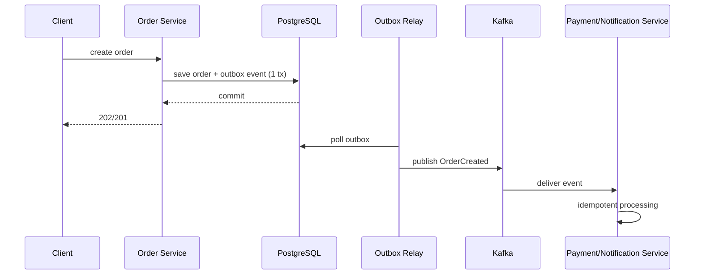

# Асинхронность и событийные системы

## Содержание

1. [Когда нужен async](#когда-нужен-async)
2. [Очередь, broker, stream и event log](#очередь-broker-stream-и-event-log)
3. [Гарантии доставки](#гарантии-доставки)
4. [Паттерны надёжной интеграции](#паттерны-надёжной-интеграции)
5. [Порядок, дедупликация и идемпотентность](#порядок-дедупликация-и-идемпотентность)
6. [Саги и распределённые бизнес-процессы](#саги-и-распределённые-бизнес-процессы)
7. [Антипаттерны event-driven архитектуры](#антипаттерны-event-driven-архитектуры)
8. [Вопросы для самопроверки](#вопросы-для-самопроверки)

## Когда нужен async

Асинхронный подход полезен, когда:

- пользовательский запрос не должен ждать долгую обработку;
- нужно сгладить пики нагрузки;
- важно развязать сервисы по времени жизни и скорости работы;
- есть fan-out на множество потребителей;
- бизнес-процесс естественно состоит из шагов и событий.

Если результат нужен прямо сейчас и в одной транзакции, async может только усложнить путь. Поэтому сначала определите, что действительно должно быть synchronous.

## Очередь, broker, stream и event log

- **Queue** — сообщение обычно обрабатывается одним consumer.
- **Pub/Sub topic** — одно событие получают несколько подписчиков.
- **Stream/Event log** — последовательность событий хранится дольше, а потребители читают её со своим offset.
- **Broker** — инфраструктурный компонент, который буферизует, маршрутизирует и помогает с доставкой сообщений.

Выбор зависит от сценария:

- фоновые задачи — queue;
- интеграция нескольких подсистем — topic;
- аналитика, CDC, replay и потоковая обработка — event log/stream.

## Гарантии доставки

| Гарантия | Что означает | Плюсы | Минусы |
|----------|--------------|-------|--------|
| At-most-once | сообщение может потеряться, но не будет повторно обработано | простота, низкая latency | риск потери |
| At-least-once | сообщение будет доставлено, но возможны дубликаты | надёжнее для бизнеса | нужна идемпотентность |
| Exactly-once | эффект как будто обработка ровно один раз | удобно концептуально | высокая сложность и ограничения по контуру |

В реальных системах чаще всего нужна комбинация **at-least-once + идемпотентный consumer**. Это практичнее и понятнее в эксплуатации.

## Паттерны надёжной интеграции

- **Transactional outbox** — событие сначала пишется в локальную БД рядом с бизнес-изменением, а потом безопасно публикуется.
- **Inbox / processed messages table** — защита от повторной обработки.
- **Dead letter queue** — изоляция сообщений, которые не удалось обработать после серии попыток.
- **Retry topics / delayed retries** — отдельные контуры повторной обработки.
- **CDC** — чтение изменений из БД как источника событий.

Эти паттерны особенно полезны, когда нельзя полагаться на распределённую транзакцию между БД и брокером.

### Пример потока с transactional outbox

Такой паттерн снимает риск dual write, когда бизнес-изменение записалось в БД, а публикация в брокер — нет, или наоборот.

## Порядок, дедупликация и идемпотентность

Порядок доставки — дорогая гарантия. Чем больше параллелизма, тем сложнее сохранить strict ordering. Поэтому всегда уточняйте:

- порядок нужен глобально или только в рамках одного aggregate/user/order;
- что происходит при повторном сообщении;
- как consumer понимает, что операция уже применена.

Идемпотентность можно обеспечить через:

- уникальный business key;
- таблицу обработанных сообщений;
- version check / optimistic concurrency control;
- естественно идемпотентные операции (`set status=PAID`, а не `increment balance`).

## Саги и распределённые бизнес-процессы

**Saga** — это координация нескольких локальных транзакций вместо одной глобальной. Есть два подхода:

- **Choreography**: сервисы реагируют на события друг друга.
- **Orchestration**: центральный orchestrator управляет шагами процесса.

Choreography даёт слабую связанность, но может превратиться в «event soup». Orchestration понятнее для сложных процессов, но создаёт более центральную точку знания и зависимости.

## Антипаттерны event-driven архитектуры

- отправка «событий» без чёткого владельца схемы и семантики;
- отсутствие DLQ и стратегии retry;
- попытка решить все задачи только через async, включая простые CRUD-сценарии;
- слишком крупные события с десятками полей «на все случаи жизни»;
- отсутствие tracing между producer и consumer.

## Вопросы для самопроверки

1. Когда broker лучше прямого HTTP-вызова?
2. Почему exactly-once редко бывает бесплатно?
3. Зачем нужен outbox pattern?
4. В каких случаях важен порядок сообщений, а когда достаточно порядка в рамках ключа?
5. Когда saga orchestration предпочтительнее choreography?

## 🔗 Связанные темы

- [Apache Kafka](../очереди/кафка/README.md) — основной прикладной раздел по event streaming и эксплуатации брокера
- [Kafka Connect](../очереди/кафка/07-kafka-connect.md) — полезно для CDC и интеграции внешних систем
