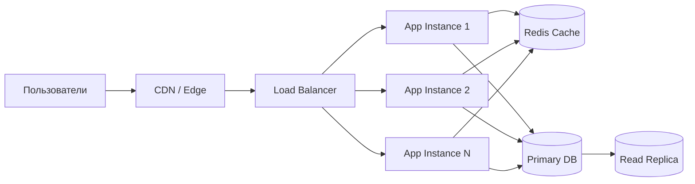

# Масштабирование, надёжность и отказоустойчивость

## Содержание

1. [Вертикальное и горизонтальное масштабирование](#вертикальное-и-горизонтальное-масштабирование)
2. [Load balancing и распределение трафика](#load-balancing-и-распределение-трафика)
3. [Устранение single points of failure](#устранение-single-points-of-failure)
4. [Graceful degradation и backpressure](#graceful-degradation-и-backpressure)
5. [Failover, disaster recovery и multi-region](#failover-disaster-recovery-и-multi-region)
6. [Capacity planning и bottleneck analysis](#capacity-planning-и-bottleneck-analysis)
7. [Практический production checklist](#практический-production-checklist)
8. [Вопросы для самопроверки](#вопросы-для-самопроверки)

## Вертикальное и горизонтальное масштабирование

**Scale-up** — усиление одного узла. Плюсы: простота, меньше сетевой сложности. Минусы: лимит железа, риск крупной точки отказа, рост стоимости.

**Scale-out** — добавление новых инстансов. Плюсы: гибкость, эластичность, лучшая устойчивость. Минусы: распределённое состояние, балансировка, консистентность, более сложный rollout.

Часто эволюция такая:

1. сначала scale-up и оптимизация запросов;
2. затем stateless сервисы и scale-out;
3. потом разделение по ролям: read replicas, workers, shards, async pipelines.

## Load balancing и распределение трафика

Load balancer помогает:

- равномерно распределять запросы;
- убирать из пула нездоровые инстансы;
- скрывать внутреннюю топологию;
- выполнять TLS termination и routing.

Популярные алгоритмы:

- round robin;
- least connections;
- consistent hashing;
- weighted routing.

**Consistent hashing** полезен, когда важна локальность данных: session affinity, partition ownership, cache locality.

### Упрощённая схема масштабирования request path

Эта схема показывает типичную эволюцию: сначала scale-out stateless-инстансов, затем выделение shared cache и read replicas для разгрузки основной БД.

## Устранение single points of failure

Single point of failure может скрываться не только в базе, но и в:

- DNS / service discovery;
- API gateway;
- cache cluster;
- очереди;
- фоновой cron-задаче;
- ручной операционной процедуре.

При проектировании задавайте вопрос к каждому критичному компоненту: что случится, если он недоступен 5 минут, 30 минут, сутки?

## Graceful degradation и backpressure

Не все функции одинаково важны. При перегрузке система должна уметь сохранять core functionality и временно отключать второстепенное.

Примеры graceful degradation:

- отключить рекомендации и персонализацию, но сохранить checkout;
- отдавать stale cache;
- замедлить background jobs;
- снижать качество ответа или детализацию данных.

**Backpressure** нужен, чтобы downstream не захлебнулся. Инструменты:

- bounded queues;
- rate limiting;
- concurrency limits;
- circuit breaker;
- load shedding.

## Failover, disaster recovery и multi-region

Важно различать:

- **High availability** — пережить локальный отказ без заметного простоя;
- **Disaster recovery** — восстановиться после серьёзной аварии или потери зоны/региона.

Ключевые метрики:

- **RTO** — сколько времени допустимо на восстановление;
- **RPO** — сколько данных можно потерять.

Multi-region стоит дорого и нужен не всегда. Он оправдан, если:

- бизнес действительно критичен к региональным сбоям;
- есть строгие требования по latency для разных географий;
- команда умеет сопровождать сложную распределённую систему.

## Capacity planning и bottleneck analysis

В system design важно искать не среднюю нагрузку, а точку насыщения.

Типовые bottleneck:

- CPU-bound бизнес-логика;
- память и GC;
- дисковые IOPS БД;
- сеть и bandwidth;
- connection pools;
- внешние лимиты сторонних API.

Полезно мыслить так: что сломается первым при росте в 3, 10 и 100 раз?

## Практический production checklist

- есть ли health/readiness checks;
- умеет ли сервис стартовать и останавливаться без потери трафика;
- покрыт ли критичный путь метриками и алертами;
- протестирован ли failover хотя бы в staging;
- есть ли rate limits и защита от перегрузки;
- известны ли RTO/RPO и владельцы процедуры восстановления.

## Вопросы для самопроверки

1. Когда scale-up ещё разумен, а когда уже нужен scale-out?
2. Как consistent hashing помогает кэшу или шардированию?
3. Что важнее для бизнеса: HA или DR, и почему это не одно и то же?
4. Что вы отключите первым при перегрузке интернет-магазина?
5. Какие single points of failure часто забывают в архитектурных схемах?

## 🔗 Связанные темы

- [Kubernetes](../kubernetes/README.md) — практический контекст для scale-out, readiness, rollout и self-healing
- [Мониторинг и логирование в Kubernetes](../kubernetes/05-мониторинг-логирование.md) — observability для production-систем
