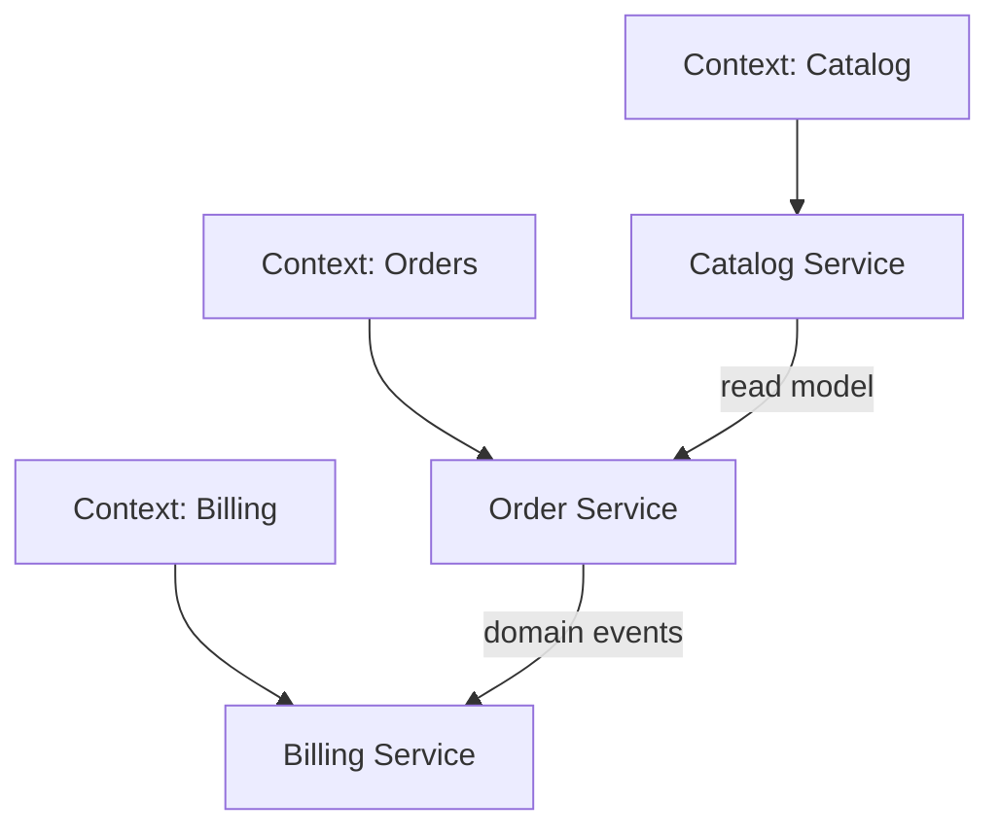

# Микросервисы, границы и декомпозиция

## Содержание

1. [Когда микросервисы оправданы](#когда-микросервисы-оправданы)
2. [Bounded context и границы сервиса](#bounded-context-и-границы-сервиса)
3. [Monolith first vs microservices first](#monolith-first-vs-microservices-first)
4. [Синхронная и асинхронная коллаборация](#синхронная-и-асинхронная-коллаборация)
5. [Distributed monolith и другие антипаттерны](#distributed-monolith-и-другие-антипаттерны)
6. [Data ownership и интеграция между сервисами](#data-ownership-и-интеграция-между-сервисами)
7. [Эволюционная декомпозиция](#эволюционная-декомпозиция)
8. [Вопросы для самопроверки](#вопросы-для-самопроверки)

## Когда микросервисы оправданы

Микросервисы — не цель, а инструмент. Они оправданы, когда:

- у системы уже есть независимые доменные области;
- команды мешают друг другу в монолите;
- разные части системы требуют разной скорости релизов и масштабирования;
- организация готова инвестировать в платформу, CI/CD, observability и операционную зрелость.

Если продукт маленький, команда одна, а домен ещё нестабилен, монолит часто будет лучшим стартом.

## Bounded context и границы сервиса

Границы сервиса лучше строить вокруг **бизнес-способностей** и модели предметной области, а не вокруг «таблицы» или «класса». Полезные признаки хорошей границы:

- у сервиса есть явный владелец данных;
- изменения внутри сервиса редко требуют координации с соседями;
- интерфейс сервиса отражает язык домена, а не детали БД;
- команда может развивать сервис относительно независимо.

## Monolith first vs microservices first

**Monolith first** часто выигрывает на раннем этапе:

- быстрее доставка первой версии;
- проще транзакции и отладка;
- меньше инфраструктурного шума.

**Microservices first** редко оправдан, кроме случаев, когда:

- компания уже имеет зрелую платформу;
- домен хорошо понятен;
- организационные границы уже определены.

Хорошая стратегия — проектировать монолит модульным и быть готовым выносить bounded contexts по мере необходимости.

## Синхронная и асинхронная коллаборация

Микросервисы часто сочетают два типа взаимодействия:

- **sync** для query/command, когда нужен немедленный результат;
- **async** для интеграционных событий и фоновых процессов.

Чем длиннее синхронная цепочка между сервисами, тем выше риск каскадного падения и сложнее поддерживать latency. Поэтому ключевой вопрос — где можно разорвать цепочку через события, кэш или локальную проекцию данных.

## Distributed monolith и другие антипаттерны

**Distributed monolith** — набор сервисов, которые нельзя релизить, масштабировать и развивать независимо. Признаки:

- общая БД между «сервисами»;
- синхронные вызовы по длинной цепочке для простого пользовательского сценария;
- одна команда меняет все сервисы одновременно;
- отсутствие контрактной дисциплины и observability.

Другие антипаттерны:

- выделение сервиса на каждую CRUD-сущность;
- чрезмерно мелкая декомпозиция;
- shared libraries с бизнес-логикой, которые сцепляют весь ландшафт;
- отсутствие platform thinking: логирование, deployment, secrets, tracing.

## Data ownership и интеграция между сервисами

У каждого сервиса должен быть владелец данных. Если несколько сервисов напрямую пишут в одну и ту же схему, границы размываются и интеграция становится хрупкой.

Подходы к обмену данными:

- API вызовы для актуальных данных;
- события для интеграции и локальных read-моделей;
- CDC или data pipeline для аналитики и вторичных потребителей.

## Эволюционная декомпозиция

Полезный путь эволюции:

1. модульный монолит с явными boundary внутри кода;
2. выделение наиболее независимых и нагруженных контуров;
3. внедрение контрактов, observability и platform practices;
4. только потом — дальнейшая декомпозиция по реальным bottleneck.

Это снижает риск построить сложную архитектуру раньше времени.

## Вопросы для самопроверки

1. Почему границы сервиса нужно строить вокруг домена, а не таблиц?
2. Когда монолит лучше микросервисов?
3. Что такое distributed monolith?
4. Почему общая БД между сервисами — тревожный сигнал?
5. Как понять, что сервис действительно можно релизить независимо?
