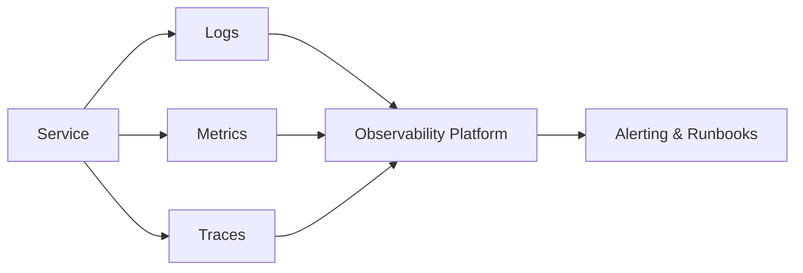

# Наблюдаемость, безопасность и эксплуатация

## Содержание

1. [Почему observability нужно проектировать заранее](#почему-observability-нужно-проектировать-заранее)
2. [Логи, метрики и трассировка](#логи-метрики-и-трассировка)
3. [Алертинг и operational excellence](#алертинг-и-operational-excellence)
4. [Базовые аспекты безопасности](#базовые-аспекты-безопасности)
5. [Secrets, access control и audit](#secrets-access-control-и-audit)
6. [Production readiness checklist](#production-readiness-checklist)
7. [Типичные ошибки эксплуатации](#типичные-ошибки-эксплуатации)
8. [Вопросы для самопроверки](#вопросы-для-самопроверки)

## Почему observability нужно проектировать заранее

Если о наблюдаемости вспоминают только после инцидента, система уже проигрывает. Хороший design сразу учитывает:

- какие сигналы скажут, что бизнес-функция работает неправильно;
- где измерять latency, error rate и saturation;
- как связать между собой запросы, сообщения и фоновые задачи;
- кто и как будет диагностировать инцидент ночью.

**Observability** — это способность отвечать на новые вопросы о состоянии системы без переписывания её с нуля.

## Логи, метрики и трассировка

Три столпа наблюдаемости:

- **Логи** — подробный контекст отдельных событий.
- **Метрики** — дешёвые агрегаты для графиков, алертов и трендов.
- **Трейсы** — путь запроса через цепочку сервисов.

Практические рекомендации:

- используйте correlation/request ID;
- логируйте структурированно, а не свободным текстом;
- измеряйте RED/USE метрики для критичных компонентов;
- не превращайте логи в хранилище бизнес-данных и секретов.

## Алертинг и operational excellence

Плохой алертинг шумит, хороший — помогает действовать. Алерты должны быть:

- привязаны к пользовательскому или бизнес-влиянию;
- редкими, но важными;
- снабжены runbook/owner/action;
- основаны на SLO, а не на случайных технических threshold.

Полезно отличать:

- page-worthy alerts;
- warning alerts;
- dashboards для анализа тенденций.

## Базовые аспекты безопасности

Безопасность в system design — это не отдельная «галочка» в конце проекта. Нужно заранее продумать:

- аутентификацию пользователей и сервисов;
- авторизацию и принцип least privilege;
- шифрование in transit и at rest;
- защиту от abuse: rate limit, WAF, bot protection;
- безопасность supply chain и зависимостей.

Особенно важно различать **authentication** (кто ты) и **authorization** (что тебе можно).

## Secrets, access control и audit

- храните секреты в выделенной системе, а не в коде и не в конфиге Git;
- ограничивайте доступ по ролям и принципу минимально необходимых прав;
- разделяйте учётные записи людей, сервисов и automation;
- включайте аудит критичных действий: изменение прав, платежей, конфигурации, данных.

Audit особенно важен в доменах с деньгами, персональными данными и compliance-требованиями.

## Production readiness checklist

Перед запуском нового сервиса спросите:

- есть ли dashboard по основным SLI;
- настроены ли алерты и известны ли их владельцы;
- есть ли threat model хотя бы в базовом виде;
- понятны ли секреты, ротация и процедура отзыва доступа;
- описаны ли процедуры rollback, restore и incident response;
- можно ли безопасно деплоить и откатывать версию.

## Типичные ошибки эксплуатации

- отсутствие correlation ID между сервисами и брокером;
- логирование паролей, токенов или чувствительных данных;
- алерты «на всё подряд» без связи с impact;
- отсутствие runbook и ответственного владельца;
- ручные операции, которые критичны для восстановления, но нигде не задокументированы.

## Вопросы для самопроверки

1. Чем observability отличается от обычного monitoring?
2. Какие метрики вы бы вынесли на главный dashboard сервиса?
3. Почему least privilege так важен в микросервисной среде?
4. Что обязательно должно быть в runbook по инциденту?
5. Какие ошибки чаще всего допускают при логировании?
