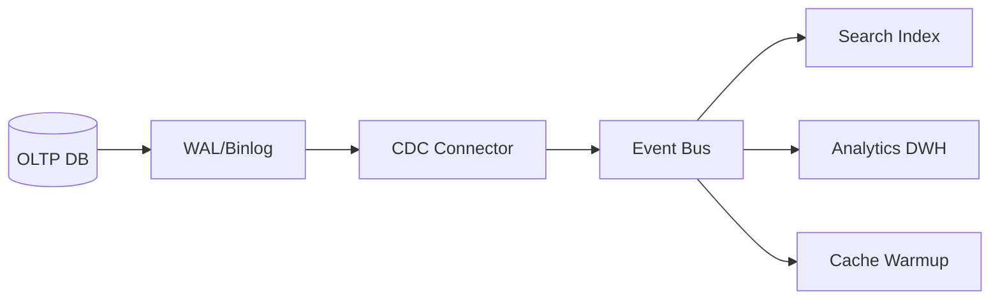

# CDC, event sourcing и materialized views

## Содержание

1. [Когда одной CRUD-модели уже недостаточно](#когда-одной-crud-модели-уже-недостаточно)
2. [Что такое CDC и где он полезен](#что-такое-cdc-и-где-он-полезен)
3. [Event sourcing: сильные стороны и цена](#event-sourcing-сильные-стороны-и-цена)
4. [Materialized views и projection-модели](#materialized-views-и-projection-модели)
5. [Schema evolution, replay и operational risks](#schema-evolution-replay-и-operational-risks)
6. [Когда не стоит использовать эти подходы](#когда-не-стоит-использовать-эти-подходы)
7. [Вопросы для самопроверки](#вопросы-для-самопроверки)
8. [Связанные темы](#связанные-темы)

## Когда одной CRUD-модели уже недостаточно

Классическая модель «сервис пишет строку в таблицу и читает её обратно» хорошо работает для большого числа систем. Но со временем появляются сценарии, где этого недостаточно:

- нужно распространять изменения в несколько downstream-систем;
- нужна история изменений, а не только текущее состояние;
- чтения и записи сильно отличаются по профилю;
- требуется replay или backfill для аналитики и новых consumers.

Именно здесь начинают обсуждать **CDC**, **event sourcing** и **materialized views**.

## Что такое CDC и где он полезен

**CDC (Change Data Capture)** — это способ читать изменения из источника данных и превращать их в поток событий или change records.

CDC полезен, когда:

- БД уже является source of truth;
- нужно передавать изменения в search, analytics, cache warmup, data lake;
- хочется избежать прямых dual write из приложения в несколько систем.

Плюсы CDC:

- меньше риска сломать бизнес-контур при интеграции;
- можно подключать новых consumers без изменения write path;
- удобно строить near-real-time data pipelines.

Ограничения:

- событие изменения строки не всегда равно бизнес-событию;
- сложнее гарантировать порядок и семантику на уровне домена;
- требуется контроль lag, reprocessing и schema evolution.

## Event sourcing: сильные стороны и цена

**Event sourcing** хранит не текущее состояние сущности, а последовательность доменных событий, из которых это состояние восстанавливается.

Преимущества:

- полный audit trail;
- естественный replay истории;
- удобство для сложных доменных процессов и временных реконструкций;
- возможность строить разные read models поверх одного event log.

Цена подхода:

- события становятся частью доменной модели и требуют строгой дисциплины;
- сложнее миграции схемы событий;
- debugging часто тяжелее, чем в CRUD-системах;
- команде нужно хорошо понимать eventual consistency и projections.

Event sourcing оправдан не везде. Он полезен там, где ценна история, реконструкция состояния и богатая доменная логика, а не просто CRUD над несколькими таблицами.

## Materialized views и projection-модели

**Materialized view** или projection — это производная read-модель, собранная из исходных данных или потока событий под конкретный use case.

Примеры:

- денормализованный профиль клиента для UI;
- лента заказов с joined-данными из нескольких bounded contexts;
- агрегаты для dashboard и аналитики;
- search index, обновляемый через CDC или event stream.

Полезные принципы:

- проектируйте read-model под конкретный query pattern;
- считайте projection disposable: при необходимости её можно пересобрать;
- отделяйте source of truth от производных представлений;
- заранее продумывайте lag tolerance для потребителей.

## Schema evolution, replay и operational risks

Чем больше система опирается на поток изменений, тем важнее управлять эволюцией схемы.

Нужно учитывать:

- backward/forward compatibility событий;
- версионирование payload;
- поведение consumers при старых и новых форматах;
- стоимость replay на больших объёмах данных;
- idempotency при повторной обработке.

Практический вопрос не только в том, **можно ли сделать replay**, но и в том, **сколько он займёт**, **как повлияет на production** и **кто отвечает за корректность результата**.

## Когда не стоит использовать эти подходы

- когда система маленькая и проще решается обычной БД и несколькими таблицами;
- когда команда не готова сопровождать async-интеграции и schema management;
- когда нет реального use case для replay, audit trail или независимых read models;
- когда event sourcing выбирают «потому что звучит современно», а не из-за доменной необходимости.

Иногда лучший выбор — обычный CRUD + outbox + несколько проекций, а не полноценный event sourcing.

## Вопросы для самопроверки

1. Чем CDC отличается от бизнес-события?
2. Когда event sourcing даёт реальную пользу, а не только сложность?
3. Почему projection стоит считать disposable-моделью?
4. Какие риски появляются при replay на production-объёмах?
5. Когда CRUD + outbox лучше полного event sourcing?

## Связанные темы

- [Асинхронность и событийные системы](05-асинхронность-и-событийные-системы.md)
- [Хранение данных и выбор базы](03-хранение-данных-и-выбор-базы.md)
- [Apache Kafka](../очереди/кафка/README.md)
- [PostgreSQL](../базы данных/postgresql/README.md)
