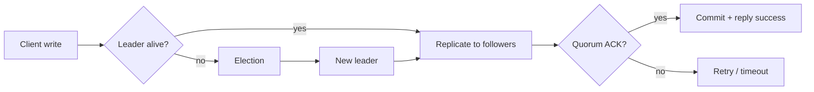
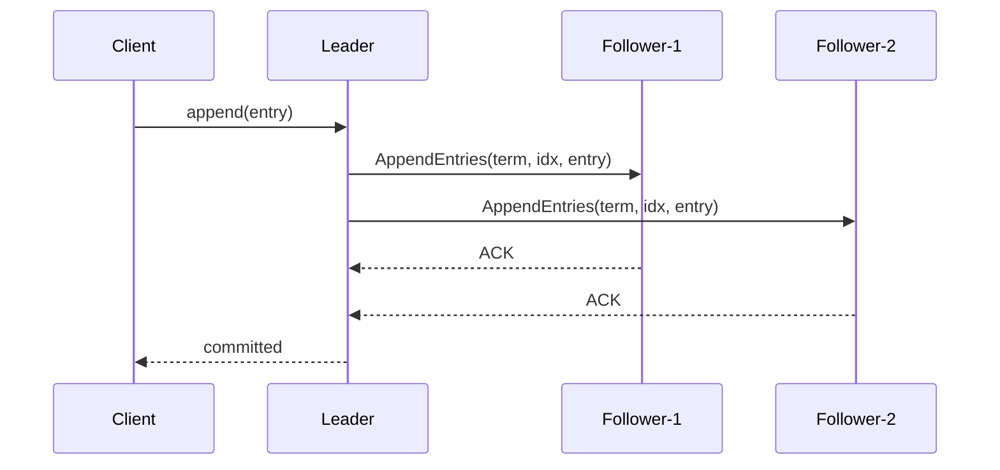
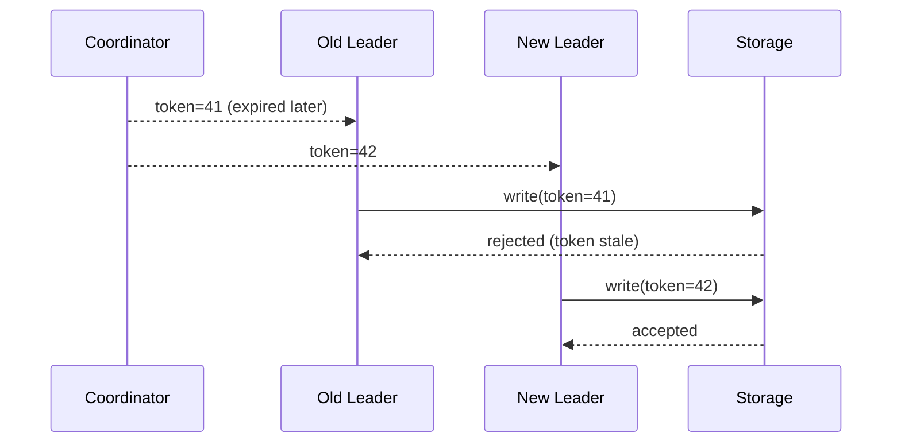
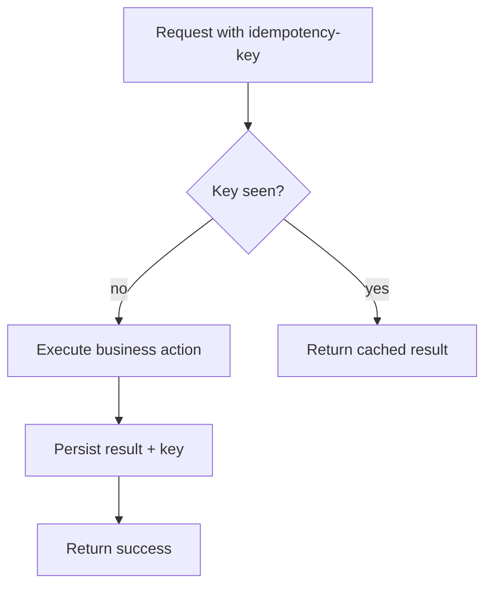

# Consensus и распределённая координация

## Содержание

1. [Зачем это нужно](#зачем-это-нужно)
2. [Ключевые модели и гарантии](#ключевые-модели-и-гарантии)
3. [Raft на практике](#raft-на-практике)
4. [Паттерны лидерства и fencing](#паттерны-лидерства-и-fencing)
5. [Exactly-once: мифы и реальность](#exactly-once-мифы-и-реальность)
6. [Идемпотентность, дедупликация и replay](#идемпотентность-дедупликация-и-replay)
7. [Геораспределённый consensus и trade-offs](#геораспределённый-consensus-и-trade-offs)
8. [Практический чек-лист для production](#практический-чек-лист-для-production)
9. [Вопросы для самопроверки](#вопросы-для-самопроверки)

## Зачем это нужно

Когда система перестаёт быть single-node, появляются проблемы координации:
- кто лидер и кто имеет право выполнять write-операции;
- как избежать split-brain;
- как сериализовать изменение критичных метаданных;
- как безопасно восстанавливаться после сетевых разделений.

> **Consensus** нужен не везде. Его применяют там, где ошибка координации дороже latency/сложности.

## Ключевые модели и гарантии

- **Safety**: «плохого» состояния не произойдёт (например, два валидных лидера одновременно).
- **Liveness**: система продолжит прогрессировать при выполнении предпосылок.
- **Linearizability**: операции выглядят как атомарно упорядоченные во времени.
- **Quorum**: решение принимается большинством участников.

## Raft на практике

Базовый цикл Raft: выбор лидера, репликация лога, commit по quorum.

Практические нюансы:
- таймауты election и heartbeat должны иметь хороший jitter;
- snapshotting обязателен для длинных журналов;
- quorum-size влияет и на latency, и на fault tolerance.

## Паттерны лидерства и fencing

Даже с lease-lock возможны «старые» лидеры после пауз GC или сетевых проблем. Для защиты используют **fencing token**.

## Exactly-once: мифы и реальность

В распределённых системах «exactly-once end-to-end» почти всегда распадается на комбинацию:
- at-least-once доставка;
- idempotent processing;
- deduplication по ключу операции;
- transactional boundary (локальная или ограниченная внешняя).

**Практика:** формулируйте гарантию узко и точно: «exactly-once в пределах топика+consumer-group+dedup-window».

## Идемпотентность, дедупликация и replay

Рекомендации:
- храните dedup-key в durable storage;
- фиксируйте TTL окна дедупликации;
- разделяйте business key и transport key;
- закладывайте replay-процедуры и backfill.

## Геораспределённый consensus и trade-offs

В multi-region quorum увеличивает RTT и снижает write-throughput.

| Стратегия | Плюсы | Минусы | Когда выбирать |
|-----------|-------|--------|----------------|
| Single-region leader | Низкая write latency | Слабее к региональным сбоям | Большинство workloads |
| Multi-region quorum | Выше устойчивость | Дороже по latency и ops | Критичные control-plane данные |
| Per-region leaders + async merge | Локальная скорость | Сложный conflict resolution | Глобальные read-heavy сценарии |

## Практический чек-лист для production

1. Определите, где нужен consensus, а где достаточно optimistic concurrency.
2. Зафиксируйте SLO для control-plane отдельно от data-plane.
3. Настройте fencing и monotonic tokens для всех write-path с лидерством.
4. Пропишите bootstrap/recovery runbook (потеря quorum, восстановление узла, reconfiguration).
5. Добавьте chaos-сценарии: network partition, clock skew, slow disk, paused process.

## Вопросы для самопроверки

1. Почему quorum «лечит» split-brain только при корректной конфигурации majority?
2. Чем lease без fencing опасен в production?
3. Когда «exactly-once» становится маркетинговым термином без инженерной ценности?
4. Какие метрики важнее всего для consensus-кластера (election rate, append latency, commit lag)?
5. В каких случаях не стоит использовать consensus-хранилище для бизнес-данных?

## Связанные материалы

- [Multi-region и geo-distributed системы](10-multi-region-и-geo-distributed-системы.md)
- [Асинхронность и событийные системы](05-асинхронность-и-событийные-системы.md)
- [CDC, event sourcing и materialized views](11-cdc-event-sourcing-и-materialized-views.md)
- [Масштабирование, надёжность и отказоустойчивость](06-масштабирование-надежность-и-отказоустойчивость.md)
