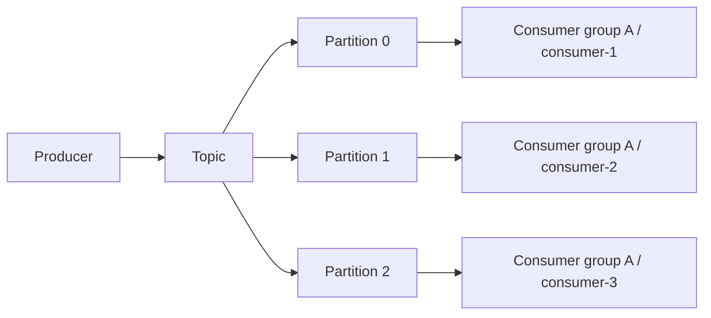
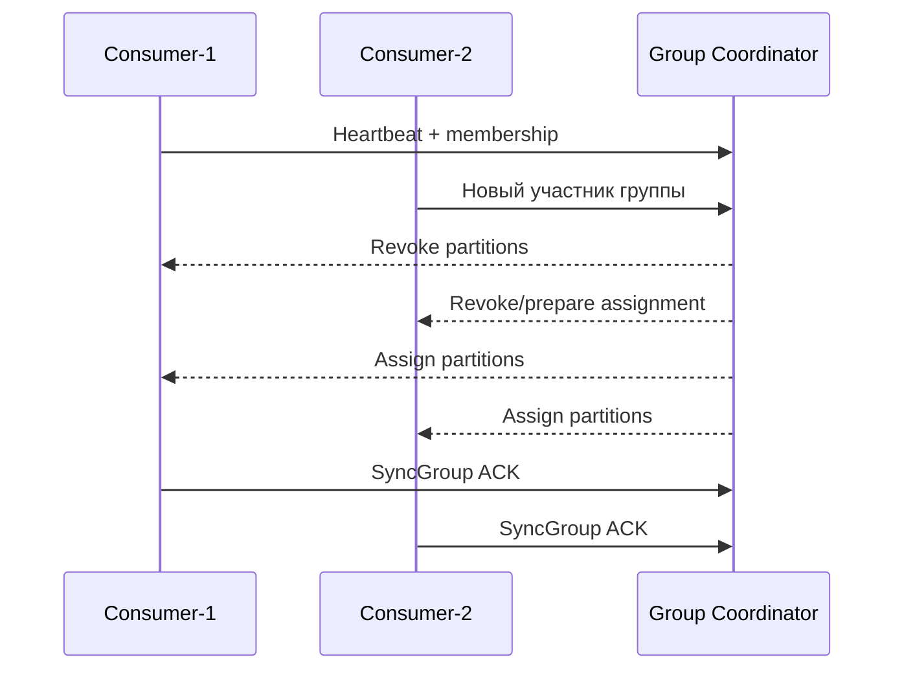
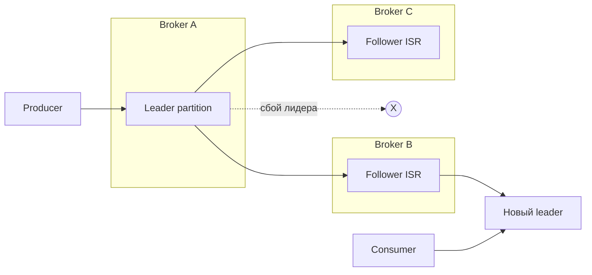

# Принципы и архитектура Apache Kafka

## Содержание

1. [Основная идея](#основная-идея)
2. [Ключевые компоненты](#ключевые-компоненты)
3. [Жизненный цикл сообщения](#жизненный-цикл-сообщения)
4. [Consumer group и управление offset](#consumer-group-и-управление-offset)
5. [Репликация и отказоустойчивость](#репликация-и-отказоустойчивость)
6. [Основные принципы масштабирования](#основные-принципы-масштабирования)
7. [Модели доставки](#модели-доставки)
8. [Практические выводы для проектирования](#практические-выводы-для-проектирования)

## Основная идея
- Kafka — распределённый commit log, к которому клиенты читают и пишут в порядке записи.
- События неизменяемы: данные только добавляются, что упрощает масштабирование и повторное чтение.

## Ключевые компоненты

| Компонент | Роль |
|-----------|------|
| **Broker** | Процесс, принимающий записи и обслуживающий клиентов; несколько брокеров образуют кластер. |
| **Topic** | Логическая шина событий. Делится на партиции для параллелизма. |
| **Partition** | Последовательность записей с упорядоченными смещениями (offset). |
| **Producer** | Клиент, отправляющий сообщения в топики. |
| **Consumer** | Клиент, читающий сообщения из топиков. Может объединяться в consumer group. |
| **ZooKeeper/KRaft** | Компонент управления метаданными (ZooKeeper в старых версиях, KRaft — встроенный consensus). |

## Жизненный цикл сообщения
1. Producer сериализует событие и отправляет его в брокер.
2. Брокер записывает событие в лог партиции, подтверждает запись в зависимости от настроек `acks`.
3. Consumer считывает сообщения по смещениям, фиксирует прогресс (offset commit) и обрабатывает событие.
4. Хранение сообщений контролируется политиками ретенции (по времени или размеру).

## Consumer group и управление offset
- **Consumer group** позволяет нескольким экземплярам приложения совместно читать один топик, деля между собой партиции.
- В пределах одной группы одна партиция назначается только одному consumer'у одновременно. Поэтому максимальный параллелизм чтения ограничен числом партиций.
- **Offset** — это позиция чтения внутри партиции. Kafka хранит offset отдельно от самих сообщений, поэтому consumer может:
  - продолжить работу после рестарта;
  - перечитать данные повторно;
  - начать чтение с нужной позиции для восстановления или отладки.

### Что происходит при ребалансировке

Ребалансировка запускается, когда:
- в group добавляется новый consumer;
- один из consumer'ов перестаёт отправлять heartbeat;
- меняется число партиций в топике;
- перезапускается приложение или координатор группы.

Во время ребалансировки Kafka временно перераспределяет партиции между участниками группы. Это полезный механизм, но он увеличивает паузу в обработке, поэтому слишком частые рестарты consumer'ов вредят стабильности.

### Автокоммит и ручной commit
- **Автокоммит** проще в настройке, но может фиксировать offset раньше, чем бизнес-обработка реально завершилась.
- **Ручной commit** даёт больше контроля: сначала обрабатываем сообщение, затем подтверждаем прогресс. Такой подход чаще используют в критичных интеграциях.

> **Важно**: offset commit — это фиксация прогресса чтения, а не подтверждение того, что событие «безопасно сохранено» в бизнес-системе. Если обработчик сначала сделал commit, а потом упал, сообщение может считаться обработанным, хотя бизнес-эффект не был достигнут.

## Репликация и отказоустойчивость
- Каждая партиция может иметь несколько реплик.
- **Leader** принимает записи и обслуживает чтение/запись клиентов.
- **Follower** копирует данные с лидера и готов подхватить роль лидера при сбое.
- **ISR (In-Sync Replicas)** — это набор реплик, которые достаточно синхронизированы с лидером и могут участвовать в подтверждении записи.

### Почему важны `acks=all` и `min.insync.replicas`
- `acks=all` требует подтверждения записи не только лидером, но и достаточным числом синхронных реплик.
- `min.insync.replicas` задаёт минимальное число ISR-реплик, необходимых для успешной записи.

Типичный production-подход:
- `replication.factor=3`;
- `acks=all`;
- `min.insync.replicas=2`.

Такой набор настроек позволяет переживать отказ одного брокера без потери подтверждённых сообщений.

### Упрощённый сценарий отказа

1. Producer пишет событие в leader партиции.
2. Leader реплицирует запись на follower-реплики.
3. После достижения условий подтверждения producer получает `ack`.
4. Если leader падает, один из ISR follower'ов становится новым leader.
5. Consumer продолжают чтение с нового leader после обновления метаданных.

## Основные принципы масштабирования
- **Горизонтальное масштабирование** достигается добавлением брокеров и партиций.
- **Балансировка нагрузки** строится вокруг ключей сообщений (partition key) и consumer group.
- **Долговечность** обеспечивается репликацией партиций и синхронными подтверждениями.
- **Параллелизм чтения** достигается количеством партиций, а не количеством consumer'ов самих по себе.
- **Порядок сообщений** гарантирован только внутри одной партиции. Если порядок критичен, связанные события должны попадать в одну и ту же партицию по ключу.

## Модели доставки

| Модель | Как достигается | Плюсы | Ограничения |
|--------|------------------|-------|-------------|
| **At-most-once** | Commit/подтверждение происходит до завершения обработки | Минимум дубликатов, низкая задержка | Возможна потеря сообщений |
| **At-least-once** | Commit выполняется после успешной обработки | Сообщения не теряются при корректной конфигурации | Возможны дубликаты, нужна идемпотентность обработчика |
| **Exactly-once** | Idempotent producer, транзакции и согласованная обработка | Минимизирует и потери, и дубликаты | Сложнее в настройке, не всегда нужен |

### Как выбирать модель
- **At-most-once** подходит для телеметрии и событий, потеря части которых допустима.
- **At-least-once** — основной вариант для большинства бизнес-сценариев.
- **Exactly-once** применяют там, где цена дубликата очень высока, например в финансовых потоках или при построении витрин данных.

## Практические выводы для проектирования
- Закладывайте число партиций, исходя из требуемого параллелизма и будущего роста нагрузки.
- Выбирайте `partition key` так, чтобы сохранить нужный порядок и избежать перекоса по нагрузке.
- Для критичных сценариев предпочитайте `acks=all`, репликацию не ниже 3 и ручной commit offset.
- Делайте consumer идемпотентными: даже при хорошей конфигурации дубликаты в распределённой системе остаются нормальным сценарием.
- Сразу определяйте политику ретенции: Kafka — это не «бесконечная очередь», а управляемый журнал событий с ограничениями по диску и времени хранения.
