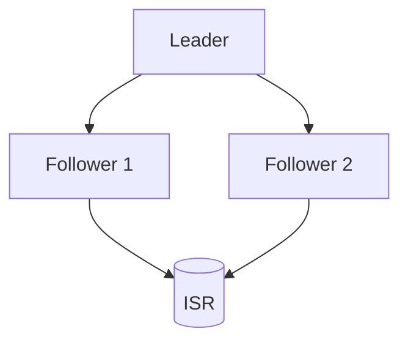
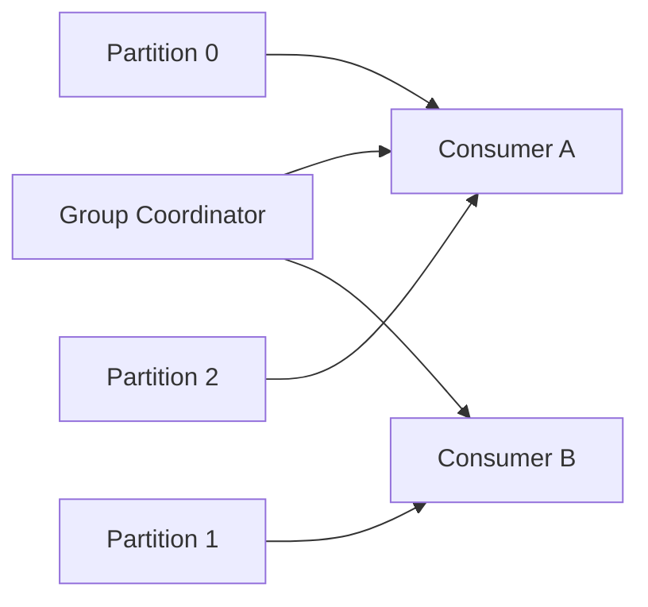

# Ключевые механизмы Kafka

## Содержание

1. [Репликация и ISR](#репликация-и-isr)
2. [Контроль потребителей](#контроль-потребителей)
3. [Сжатие и форматы сообщений](#сжатие-и-форматы-сообщений)
4. [Паттерны партиционирования](#паттерны-партиционирования)
5. [Гарантии порядка](#гарантии-порядка)
6. [Наблюдаемость](#наблюдаемость)

## Репликация и ISR

- Каждая партиция имеет лидера и фолловеров.
- In-Sync Replica (ISR) — набор реплик, синхронных с лидером.
- `min.insync.replicas` ограничивает минимальное количество синхронных реплик для подтверждения записи.

## Контроль потребителей

- Consumer group управляется координатором, который распределяет партиции.
- Ребалансировка происходит при изменении состава группы.
- Offset хранится в `__consumer_offsets` и может быть автокоммитом или ручным.

## Сжатие и форматы сообщений
- Поддержка `gzip`, `snappy`, `lz4`, `zstd` для экономии диска и сети.
- Форматы: Avro, JSON, Protobuf; схема управляется через Schema Registry.

## Паттерны партиционирования
- Round-robin: равномерно распределяет сообщения без ключа.
- Sticky partitioner: минимизирует переключения между партициями.
- По ключу: обеспечивает порядок сообщений внутри ключа.

## Гарантии порядка
- Внутри одной партиции порядок строгий.
- Для нескольких партиций порядок не гарантируется, используйте ключи или транзакции.

## Наблюдаемость
- Метрики JMX и экспортеры (Prometheus).
- Логи аудитории: потребление, запись, задержки.
- Kafka Connect и MirrorMaker для интеграций.
