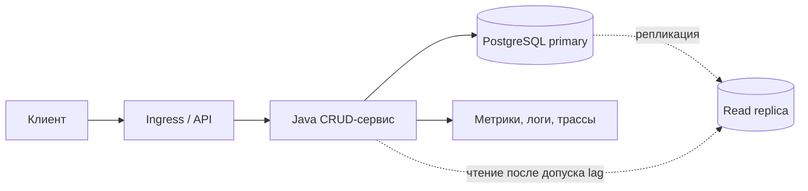

# Практикум: синхронный CRUD-сервис каталога

## Содержание

1. [Актуальность материала](#актуальность-материала)
2. [Контекст и требования](#контекст-и-требования)
3. [Нагрузка и ограничения](#нагрузка-и-ограничения)
4. [Контракты и модель данных](#контракты-и-модель-данных)
5. [Схема компонентов](#схема-компонентов)
6. [Этап 1 — корректный монолит](#этап-1--корректный-монолит)
7. [Этап 2 — безопасная эксплуатация](#этап-2--безопасная-эксплуатация)
8. [Этап 3 — чтение под нагрузкой](#этап-3--чтение-под-нагрузкой)
9. [Этап 4 — эволюция без простоя](#этап-4--эволюция-без-простоя)
10. [Итоговая защита](#итоговая-защита)

## Актуальность материала

- **Проверено:** 4 августа 2026 года.
- **Цель:** стабильные концепции HTTP, Java 21+, PostgreSQL 16–18, Kubernetes 1.30+; примеры имеют статус `current`.
- **Первичные источники для сверки реализации:** [Spring Web MVC](https://docs.spring.io/spring-framework/reference/web/webmvc.html), [PostgreSQL: concurrency control](https://www.postgresql.org/docs/current/mvcc.html), [Kubernetes Deployments](https://kubernetes.io/docs/concepts/workloads/controllers/deployment/), [AWS Well-Architected](https://docs.aws.amazon.com/wellarchitected/latest/framework/welcome.html).
- Конкретные managed-сервисы и лимиты проверьте повторно перед реализацией.

## Контекст и требования

Спроектируйте API каталога товаров для внутренней панели и витрины.

**Функциональные требования:** создать, получить, изменить и архивировать товар; искать по категории и статусу; хранить историю цены; запрещать потерю параллельных правок; поддержать постраничную выдачу.

**Нефункциональные требования:** availability 99,9% в месяц; p95 чтения ≤ 150 мс и записи ≤ 300 мс; RPO ≤ 5 минут, RTO ≤ 30 минут; аудит административных изменений 1 год; TLS и least privilege. Обсудите, включают ли SLO клиентскую сеть и зависимости.

## Нагрузка и ограничения

Исходные гипотезы: 2 млн товаров, 20 млн чтений и 200 тыс. записей в сутки; пик равен 8× среднему; средний ответ 4 КБ; рост 5% в месяц.

- Среднее чтение: `20 000 000 / 86 400 ≈ 232 RPS`, пик ≈ 1 850 RPS.
- Средняя запись: ≈ 2,3 RPS, пик ≈ 19 RPS.
- Пиковый исходящий payload: `1 850 × 4 КБ ≈ 7,4 МБ/с` без протокольных накладных расходов.

Ограничения: небольшая команда, PostgreSQL уже поддерживается; персональные данные не хранятся; строгая консистентность нужна для изменения цены, но поиск может отставать до минуты. Проведите sensitivity analysis для размера ответа, burst и роста.

## Контракты и модель данных

```http
POST /v1/products
Idempotency-Key: 018f...
Content-Type: application/json

{"sku":"A-42","name":"Кофемолка","categoryId":17,"price":{"amount":"4990.00","currency":"RUB"}}
```

Ответ: `201 Created`, `Location`, `ETag: "7"`. Обновление — `PUT /v1/products/{id}` с `If-Match`; конфликт версии — `412`, повтор ключа с иным payload — `409`. Ошибки оформите как `application/problem+json` с `type`, `title`, `status`, `code`, `traceId`; не раскрывайте stack trace. Для списка выберите keyset cursor вместо нестабильного offset и зафиксируйте сортировку.

```sql
CREATE TABLE product (
  id bigint GENERATED ALWAYS AS IDENTITY PRIMARY KEY,
  sku text NOT NULL UNIQUE,
  name text NOT NULL,
  category_id bigint NOT NULL,
  price_minor bigint NOT NULL CHECK (price_minor >= 0),
  currency char(3) NOT NULL,
  status text NOT NULL CHECK (status IN ('DRAFT','ACTIVE','ARCHIVED')),
  version bigint NOT NULL DEFAULT 0,
  updated_at timestamptz NOT NULL
);
```

Добавьте `price_history`, `idempotency_request(key, request_hash, response, expires_at)` и `audit_log`; определите FK, retention, индексы и границы транзакций. Сопоставьте решения с [Spring Data](../java/spring/03-spring-data.md), [транзакциями PostgreSQL](../базы%20данных/postgresql/05-transactions.md) и [оптимизацией запросов](../базы%20данных/postgresql/10-query-optimization-execution-plans.md).

## Схема компонентов



Схема показывает возможный путь роста; реплика не обязательна на первом этапе.

## Этап 1 — корректный монолит

Реализуйте один Spring Boot deployable и PostgreSQL: валидацию, транзакции, optimistic locking, единый error mapping, request timeout и graceful shutdown. Напишите unit, repository-интеграционные тесты через Testcontainers, API contract и concurrency test двух обновлений. См. [Spring Boot](../java/spring/02-spring-boot.md) и [стратегию тестирования](../тестирование/05-best-practices.md).

**Архитектурное ревью:** где проходит транзакция? Что произойдёт при неизвестном результате после timeout? Почему `POST` retry безопасен или опасен? Какие invariants защищает БД?

**Ожидаемые trade-offs:** монолит проще выпускать и отлаживать, но связывает масштабирование; optimistic locking экономичен при редких конфликтах, но требует UX повторного разрешения; idempotency storage повышает надёжность и стоимость.

## Этап 2 — безопасная эксплуатация

Добавьте OAuth2/OIDC, RBAC `viewer/editor/admin`, audit trail, redaction, rate limit и dependency timeouts. Определите RED-метрики, latency histogram, trace propagation, structured logs, SLO burn-rate alerts и runbook. Проверьте backup/restore, PITR, секреты и network policy; выполните нагрузочный, security и failure test.

**Архитектурное ревью:** как отличить 4xx от деградации? Как ограничить cardinality? Кто может менять цену и читать аудит? Как доказать RPO/RTO восстановлением, а не наличием backup?

**Ожидаемые trade-offs:** подробная телеметрия ускоряет диагностику, но стоит денег и несёт риск утечки; жёсткий rate limit защищает сервис, но способен наказать легитимный burst; синхронный аудит упрощает гарантии, но увеличивает latency.

## Этап 3 — чтение под нагрузкой

Снимите query plans, добавьте только доказанные индексы; сравните вертикальное масштабирование, read replica, cache-aside и отдельный search index. Определите cache key/TTL/invalidation, защиту от stampede и поведение read-after-write. Рассчитайте CPU, connections, IOPS, storage, bandwidth и 30% headroom; задайте autoscaling по saturation, а не только CPU. См. [кэширование](../system%20design/04-кэширование.md) и [Kubernetes autoscaling](../kubernetes/03-деплоймент-сервисы.md).

**Архитектурное ревью:** какая метрика подтверждает bottleneck? Допустим ли replica lag? Что происходит при cache outage? Когда поиск окупает второй источник данных?

**Ожидаемые trade-offs:** cache снижает latency и DB load, но усложняет консистентность; replica добавляет capacity и operational burden; лишние индексы ускоряют чтение ценой записи и места.

## Этап 4 — эволюция без простоя

Проведите expand/migrate/contract: nullable-колонка → dual-compatible код → backfill малыми батчами → constraint validation → удаление старого поля. Опишите rollback и совместимость двух версий приложения. Разверните canary, PodDisruptionBudget и probes. Спроектируйте DR: restore в изолированную среду, переключение DNS/traffic, reconciliation и возврат; сравните single-region multi-AZ с warm standby другого региона. См. [миграции](../system%20design/12-эволюция-системы-и-миграции-без-простоя.md), [Kubernetes](../kubernetes/README.md) и [AWS](../aws/README.md).

**Архитектурное ревью:** переживёт ли old binary новую schema? Как throttling backfill защищает primary? Кто объявляет disaster? Какие данные могут потеряться в пределах RPO?

**Ожидаемые trade-offs:** online migration длительнее и временно дублирует модель; multi-region улучшает RTO, но повышает стоимость и риск split-brain; canary снижает blast radius, но усложняет анализ.

## Итоговая защита

Представьте минимум две архитектуры и условия переключения между ними. Объясните обработку ошибок, идемпотентность, миграции, observability, security, тестовую пирамиду, capacity forecast на 12 месяцев и протокол DR drill. Нет единственного решения: оценка зависит от проверяемости assumptions, согласованности гарантий и признанных рисков.

<script type="module" src="../assets/mermaid-init.js"></script>
