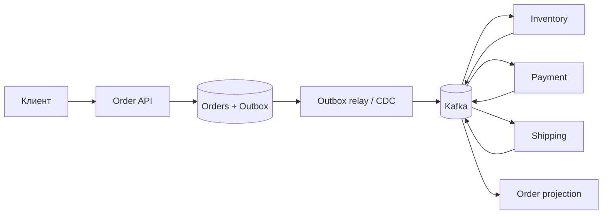

---
---

# Практикум: event-driven обработка заказов

## Содержание

1. [Актуальность материала](#актуальность-материала)
2. [Контекст и требования](#контекст-и-требования)
3. [Нагрузка и ограничения](#нагрузка-и-ограничения)
4. [API и событийные контракты](#api-и-событийные-контракты)
5. [Модель данных и компоненты](#модель-данных-и-компоненты)
6. [Этап 1 — транзакционное ядро](#этап-1--транзакционное-ядро)
7. [Этап 2 — надёжная доставка](#этап-2--надёжная-доставка)
8. [Этап 3 — saga и масштабирование](#этап-3--saga-и-масштабирование)
9. [Этап 4 — эксплуатация и DR](#этап-4--эксплуатация-и-dr)
10. [Итоговая защита](#итоговая-защита)

## Актуальность материала

- **Проверено:** 4 августа 2026 года.
- **Цель:** Java 21+, PostgreSQL 16–18, Kafka 3.7–4.x; примеры `current`, контракты учебные.
- **Первичные источники:** [Kafka design](https://kafka.apache.org/documentation/#design), [Kafka producer configuration](https://kafka.apache.org/documentation/#producerconfigs), [PostgreSQL transactions](https://www.postgresql.org/docs/current/tutorial-transactions.html), [CloudEvents specification](https://github.com/cloudevents/spec).
- Перед реализацией сверьте настройки клиента с выбранной версией Kafka; «exactly once» не заменяет end-to-end идемпотентность внешних эффектов.

## Контекст и требования

Marketplace принимает заказ, резервирует товар, авторизует оплату и запускает доставку.

**Функциональные требования:** создать/отменить заказ; наблюдать статус; резервировать позиции; инициировать платёж; компенсировать частичный успех; публиковать факты для аналитики и уведомлений.

**Нефункциональные требования:** API availability 99,95%; p95 принятия ≤ 250 мс без ожидания fulfillment; 99% заказов приходят в терминальный статус за 2 минуты; не потерять подтверждённый заказ; RPO ≤ 1 минута, RTO ≤ 1 час; события содержат минимум PII.

## Нагрузка и ограничения

Гипотезы: 5 млн заказов/сутки, пик 10× среднего ≈ 580 order commands/s; 6 доменных событий на заказ ≈ 350 events/s в среднем и 3 500/s в пик; 2 КБ/событие ≈ 7 МБ/с пикового payload. Хранение 30 дней без replication ≈ 1,8 ТБ; пересчитайте с replication factor, индексами и 35% headroom.

Ограничения: платёжный провайдер допускает 300 RPS и отвечает неоднозначно при timeout; склад принимает идемпотентный `reservationId`; порядок нужен внутри заказа, а не глобально; PII нельзя помещать в долгоживущий log.

## API и событийные контракты

```http
POST /v1/orders
Idempotency-Key: 01J...

{"customerId":"c-7","items":[{"sku":"A-42","quantity":2}]}
```

Ответ `202 Accepted` содержит `orderId`, `status: PENDING`, `statusUrl`. Валидация — `400/422`, повтор иного payload под тем же ключом — `409`, перегрузка — `429/503` с `Retry-After`.

```json
{
  "specversion": "1.0",
  "id": "01J...",
  "type": "commerce.order.created.v1",
  "source": "/order-service",
  "subject": "orders/o-42",
  "time": "2026-08-04T12:00:00Z",
  "datacontenttype": "application/json",
  "data": {"orderId":"o-42","customerRef":"c-7","totalMinor":998000,"currency":"RUB"}
}
```

Зафиксируйте partition key=`orderId`, schema compatibility, semantic versioning, owner и retention. Событие — неизменяемый факт; команды именуйте отдельно. Не обещайте глобальный порядок. Изучите [Kafka Schema Registry](../очереди/кафка/08-schema-registry.html) и [асинхронные системы](../system%20design/05-асинхронность-и-событийные-системы.html).

## Модель данных и компоненты

`orders(id, customer_id, status, total_minor, currency, version, created_at)`, `order_item`, `outbox(id, aggregate_id, type, payload, created_at, published_at)`, `processed_message(consumer, message_id, result, processed_at)`, `saga(order_id, step, state, deadline_at)`. Уникальные ключи защищают business id и deduplication; определите retention и очистку.



## Этап 1 — транзакционное ядро

Сначала сохраните заказ и outbox-запись одной PostgreSQL-транзакцией; `GET` читает authoritative state. Реализуйте state machine с допустимыми переходами, request idempotency и optimistic locking. Напишите unit/property tests переходов, DB integration, API contracts и тесты гонок. Сравните polling publisher и CDC, не внедряя оба автоматически.

**Архитектурное ревью:** где commit point ответа `202`? Может ли заказ существовать без события? Как клиент узнает исход? Какие состояния терминальны?

**Ожидаемые trade-offs:** outbox устраняет опасный dual write ценой relay и cleanup; polling проще CDC, но создаёт lag/load; асинхронный API быстрее, но требует status UX.

## Этап 2 — надёжная доставка

Настройте ключи partition, producer acknowledgements и retry policy; consumer делает DB-effect и запись inbox/dedup в одной транзакции, а offset подтверждает после неё. Обработайте duplicate, poison message, schema mismatch, timeout и rebalance. Введите retry topic/DLQ только с owner, лимитом попыток, redrive-процедурой и алертом. Проверьте crash до/после side effect и replay production-like потока.

**Архитектурное ревью:** что означает at-least-once на каждой границе? Каков idempotency key платежа? Сохраняется ли порядок при retry? Можно ли безопасно replay после исправления бага?

**Ожидаемые trade-offs:** dedup хранит состояние и требует retention; DLQ изолирует poison events, но может скрыть business backlog; строгий порядок ограничивает parallelism; транзакции Kafka не покрывают произвольный внешний API. См. [механизмы Kafka](../очереди/кафка/03-ключевые-механизмы.html).

## Этап 3 — saga и масштабирование

Выберите choreography или orchestrator и обоснуйте. Задайте deadlines и компенсации: release inventory, void/refund payment, cancel shipment; компенсация сама идемпотентна и может требовать ручной reconciliation. Рассчитайте partitions по throughput, consumer processing rate и сроку восстановления backlog: `drain time = backlog / (capacity - arrival rate)`. Добавьте backpressure, quota и bulkhead для платёжного лимита.

**Архитектурное ревью:** где виден общий workflow? Что делать при необратимой отправке? Как избежать циклов событий? Сколько partitions нужно сейчас и через год? Как меняется ordering при repartition?

**Ожидаемые trade-offs:** orchestration облегчает наблюдение, но концентрирует coordination; choreography снижает coupling, но размывает процесс; больше partitions даёт throughput ценой порядка, rebalance и стоимости.

## Этап 4 — эксплуатация и DR

Определите SLI: accept latency/error rate, consumer lag в секундах, oldest-message age, terminal-time, duplicate/compensation/DLQ rate. Протяните correlation/trace context без высокой cardinality. Примените mTLS/ACL, отдельные service accounts, encryption, schema authorization и secret rotation. Проведите backward-compatible миграцию через dual-read/dual-write или upcaster и canary consumers.

Для DR задокументируйте восстановление DB, topic/config/schema registry, offsets либо полный replay, failover DNS и reconciliation платежей. Репетируйте broker loss, AZ loss, corrupted deployment и region loss; сравните backup/restore, warm standby и active-active. Используйте [Kafka production](../очереди/кафка/10-эксплуатация-production.html), [observability](../system%20design/08-наблюдаемость-безопасность-и-эксплуатация.html), [Kubernetes](../kubernetes/README.html) и [AWS](../aws/README.html).

**Архитектурное ревью:** какие метрики являются пользовательскими? Совместимы ли rolling versions? Как проверить RPO/RTO? Как исключается повторный charge после failover?

**Ожидаемые trade-offs:** multi-region replication сокращает RPO, но усложняет ownership и порядок; replay восстанавливает projections, но требует детерминизма; расширенная трассировка улучшает расследования ценой sampling/storage.

## Итоговая защита

Защитите контракты, consistency model, error taxonomy, идемпотентность end-to-end, миграции, security, observability, тестовую стратегию, capacity на 12 месяцев и DR runbook. Представьте альтернативу без Kafka или без saga и критерии, при которых она выгоднее.

<script type="module" src="../assets/mermaid-init.js"></script>
