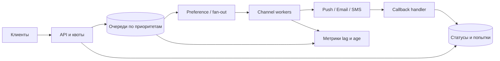

# Практикум: высоконагруженный сервис уведомлений

## Содержание

1. [Актуальность материала](#актуальность-материала)
2. [Контекст и требования](#контекст-и-требования)
3. [Нагрузка и ограничения](#нагрузка-и-ограничения)
4. [Контракты и модель данных](#контракты-и-модель-данных)
5. [Схема компонентов](#схема-компонентов)
6. [Этап 1 — минимальный надёжный путь](#этап-1--минимальный-надёжный-путь)
7. [Этап 2 — очереди и защита зависимостей](#этап-2--очереди-и-защита-зависимостей)
8. [Этап 3 — персонализация и масштабирование](#этап-3--персонализация-и-масштабирование)
9. [Этап 4 — multi-region и DR](#этап-4--multi-region-и-dr)
10. [Итоговая защита](#итоговая-защита)

## Актуальность материала

- **Проверено:** 4 августа 2026 года.
- **Цель:** стабильные distributed-systems практики, Java 21+, Kafka 3.7–4.x, Kubernetes 1.30+; примеры `current`.
- **Первичные источники:** [Kubernetes HPA](https://kubernetes.io/docs/tasks/run-application/horizontal-pod-autoscale/), [AWS SQS quotas](https://docs.aws.amazon.com/AWSSimpleQueueService/latest/SQSDeveloperGuide/quotas-messages.html), [AWS SNS quotas](https://docs.aws.amazon.com/general/latest/gr/sns.html), [OpenTelemetry specification](https://opentelemetry.io/docs/specs/).
- Квоты провайдеров зависят от региона и аккаунта: перед capacity review запросите реальные лимиты.

## Контекст и требования

Сервис принимает transactional и bulk-уведомления, учитывает предпочтения и quiet hours, рендерит шаблон и доставляет push/email/SMS.

**Функциональные требования:** одиночная и пакетная отправка; расписание; локализация; приоритеты; opt-out; статус доставки; suppression/dedup; отмена ещё не отправленной кампании.

**Нефункциональные требования:** ingest 99,99%; p95 API ≤ 100 мс; 99% transactional доставлены провайдеру за 10 секунд, bulk — за 15 минут; per-tenant fairness; RPO transactional ≤ 1 минута, RTO ≤ 30 минут; privacy deletion и audit. Доставка провайдером вне прямого SLO должна измеряться отдельно.

## Нагрузка и ограничения

Гипотезы: 100 млн уведомлений/сутки (≈ 1 157/s), пик 20× ≈ 23 тыс./с; fan-out 1,3 попытки/уведомление; envelope 1 КБ даёт ≈ 30 МБ/с пикового входа после fan-out. Bulk-кампания — 20 млн получателей за 15 минут, то есть ≈ 22 тыс./с только для неё.

Провайдерские квоты: push 50 тыс./с, email 8 тыс./с, SMS 1 тыс./с; они являются входными гипотезами. Рассчитайте backlog, число workers (`target rate / measured worker rate`), partitions/shards, storage по retention и headroom 40%. Учтите суточный профиль, retry amplification и региональный отказ.

## Контракты и модель данных

```http
POST /v1/notifications
Idempotency-Key: 01J...

{"tenantId":"t-1","recipientId":"u-7","templateId":"receipt-v3","channels":["PUSH","EMAIL"],"priority":"TRANSACTIONAL","parameters":{"order":"o-42"}}
```

Ответ `202` с `notificationId`; `GET /v1/notifications/{id}` возвращает агрегированный статус и причины. Не принимайте произвольный HTML от недоверенного клиента. Для bulk API храните ссылку на immutable audience snapshot, а не миллионы адресатов в request.

Событие `notification.requested.v1` содержит `eventId`, `tenantId`, `notificationId`, `recipientRef`, `templateVersion`, `channels`, `priority`, `scheduledAt`, `correlationId`; PII разрешайте worker через защищённый профиль по короткоживущему доступу. Delivery result включает provider message id и нормализованный error class.

Модель: `notification`, `delivery_attempt`, `idempotency_key`, `template_version`, `preference`, `suppression`, `campaign`, `audience_chunk`. Разделяйте immutable intent и изменяемое состояние; задайте TTL payload/status, legal hold, encryption и partition key. Изучите [Java concurrency](../java/multithreading/README.md), [PostgreSQL partitioning](../базы%20данных/postgresql/09-partitioning-sharding.md) и [Kafka](../очереди/кафка/README.md).

## Схема компонентов



## Этап 1 — минимальный надёжный путь

Реализуйте API, durable intent, outbox и один worker одного канала. Введите idempotency на ingest и provider send, immutable template version, consent check и state machine. Классифицируйте ошибки: permanent (invalid address), transient (timeout/429/5xx), ambiguous (timeout после send). Retry — exponential backoff с jitter, deadline и max attempts; неоднозначный исход сверяется по provider idempotency/status.

Тесты: unit для policy/template, integration с БД/очередью, contract с provider stub, duplicate/concurrency, timeout boundary, golden rendering и end-to-end. См. [Testcontainers](../тестирование/02-testcontainers.md).

**Архитектурное ревью:** когда API вправе вернуть `202`? Какая запись является source of truth? Как не отправить после opt-out? Как различить retryable и permanent?

**Ожидаемые trade-offs:** durable acceptance повышает latency записи, но предотвращает потерю; provider idempotency упрощает ambiguity, но доступна не всегда; поздняя проверка consent точнее, но добавляет dependency.

## Этап 2 — очереди и защита зависимостей

Разделите transactional/bulk очереди, примените weighted fair scheduling, tenant token buckets, channel concurrency limits, circuit breaker и backpressure. Запретите бесконечные retries; DLQ должна иметь owner, TTL и redrive с повторной проверкой consent. Autoscaling связывайте с oldest-message age и drain rate; задайте minimum capacity для transactional.

**Архитектурное ревью:** может ли bulk вытеснить receipt? Где enforced глобальная provider quota? Что произойдёт при 30-минутном outage? Как избежать retry storm?

**Ожидаемые trade-offs:** отдельные очереди обеспечивают isolation ценой ресурсов; batching повышает throughput, но ухудшает tail latency; circuit breaker сохраняет систему, но увеличивает backlog; strict fairness может недоиспользовать capacity.

## Этап 3 — персонализация и масштабирование

Добавьте audience chunking, локализованный rendering, immutable object storage для больших payload, callback ingestion и reconciliation job. Сравните push и pull fan-out, PostgreSQL/Kafka/managed queues, единый worker и channel-specific workers. Выполните capacity test до saturation и найдите bottleneck по CPU, heap/GC, connections, IOPS, bandwidth и provider quota. Прогнозируйте baseline, peak, failover peak и стоимость на уведомление.

В observability включите accept/error rate, queue age по priority/channel, send latency, provider errors, retry amplification, suppression и SLO attainment; используйте exemplars/traces и ограниченную cardinality. Security: OIDC, tenant isolation, least privilege, KMS encryption, signed callbacks, replay protection, secrets rotation, audit и запрет PII в логах.

**Архитектурное ревью:** где проходит tenant boundary? Как меняется шаблон для уже поставленного сообщения? Что важнее при overload: freshness, fairness или completeness? Какие метрики предсказывают нарушение SLO?

**Ожидаемые trade-offs:** pre-render упрощает worker, но делает payload крупнее и данные менее свежими; pull fan-out сглаживает нагрузку, но усложняет campaign progress; managed services снижают ops, но добавляют квоты и lock-in.

## Этап 4 — multi-region и DR

Выполните expand/contract миграцию schema и contract compatibility test с rolling versions. Сравните active-passive и active-active с home region tenant/recipient, глобальным idempotency key и fencing. Опишите replication lag, route failover, дубли при переключении, callback routing и reconciliation. DR drill: потеря workers, queue, DB/AZ, провайдера и региона; измерьте RPO/RTO и время drain backlog после возврата.

Не называйте backup стратегией, пока не выполнен restore. Зафиксируйте control-plane dependencies, IaC, восстановление ключей/секретов, шаблонов и suppression lists. См. [multi-region](../system%20design/10-multi-region-и-geo-distributed-системы.md), [Kubernetes observability](../kubernetes/05-мониторинг-логирование.md), [AWS messaging](../aws/07-sqs.md) и [SNS](../aws/08-sns.md).

**Архитектурное ревью:** как исключить двойную отправку из двух регионов? Можно ли потерять status, но не intent? Что произойдёт с quiet hours при delayed drain? Каков критерий возврата в primary?

**Ожидаемые trade-offs:** active-active уменьшает региональную latency, но требует ownership/fencing и дороже; active-passive проще, но standby деградирует без учений; строгая глобальная дедупликация добавляет latency и точку координации.

## Итоговая защита

Представьте две допустимые архитектуры для разных бюджетов. Защитите error policy, идемпотентность, миграции, observability, security/privacy, тесты, capacity model и DR. Отдельно перечислите assumptions, эксперименты для их проверки и сигналы, при которых архитектуру следует пересмотреть.

<script type="module" src="../assets/mermaid-init.js"></script>
