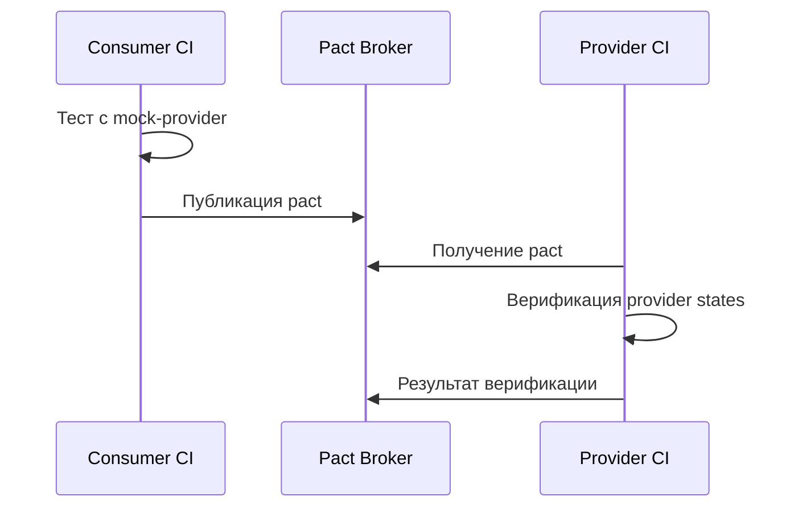
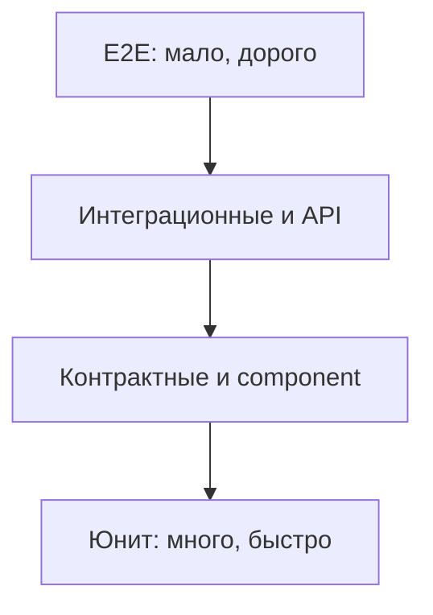

# Контрактное тестирование

## Содержание

1. [Актуальность материала](#актуальность-материала)
2. [Зачем нужен контракт](#зачем-нужен-контракт)
3. [Consumer-driven contracts](#consumer-driven-contracts)
4. [Совместимость схем](#совместимость-схем)
5. [Границы видов тестов](#границы-видов-тестов)
6. [Место в стратегии](#место-в-стратегии)
7. [Практика и CI](#практика-и-ci)
8. [Упражнения](#упражнения)
9. [Вопросы для самопроверки](#вопросы-для-самопроверки)

## Актуальность материала

- **Дата проверки:** 2026-08-04
- **Целевая версия или диапазон:** Pact specification 4.x; OpenAPI Specification 3.0–3.1; AsyncAPI 3.0
- **Статус примеров:** `current`
- **Первичные источники:** [Pact documentation](https://docs.pact.io/); [OpenAPI Specification](https://spec.openapis.org/oas/); [AsyncAPI Specification](https://www.asyncapi.com/docs/reference/specification/latest)

## Зачем нужен контракт

**Контракт** — наблюдаемые обязательства между consumer и provider: форма запроса, форма ответа/события, статусы, заголовки и семантика значимых полей. Он локализует несовместимость быстрее и дешевле E2E-теста, но не доказывает корректность сети, БД или бизнес-процесса.

## Consumer-driven contracts

В **consumer-driven contract (CDC)** consumer записывает только реально используемые им взаимодействия. Provider проверяет каждый контракт на своей реальной реализации.

1. Consumer задаёт предусловие (**provider state**), запрос и матчеры ответа.
2. Consumer-тест получает pact-артефакт; случайные поля описываются матчерами типа/формата, а не хрупкими литералами.
3. Provider подготавливает состояние и проигрывает все взаимодействия.
4. Deployment gate (`can-i-deploy`) учитывает матрицу версий consumer/provider, а не просто «последний pact».

> CDC не равен снимку всего OpenAPI: слишком широкий контракт заставляет provider поддерживать поля, которые consumer не читает.

## Совместимость схем

**Backward compatibility** означает, что новый producer/provider не ломает старых consumers; **forward compatibility** — что старый consumer способен принять данные новой схемы.

| Изменение | Обычный риск | Безопасная тактика |
|---|---|---|
| Добавить optional-поле | Низкий, если reader игнорирует неизвестное | Добавить и CDC для нужного consumer |
| Удалить/переименовать поле | Высокий | Expand/contract: добавить, мигрировать, удалить |
| Сузить enum/диапазон | Высокий | Новая версия или поэтапная миграция |
| Сменить тип/семантику | Критический | Новое поле или endpoint/event version |

В CI сочетают: lint спецификации, schema diff по явной compatibility policy и CDC-верификацию. JSON Schema/OpenAPI проверяет форму; CDC показывает, какая форма реально нужна consumer.

## Границы видов тестов

| Вид | Процессы/сеть | Реальный provider | Что доказывает |
|---|---:|---:|---|
| Consumer contract | 1 | Нет, mock | Consumer формирует/читает оговорённое |
| Provider verification | 1 | Да | Provider отвечает каждому pact |
| Schema conformance | 1 | Да/нет | Payload соответствует схеме |
| Интеграционный | 2+ | Да | Реальные компоненты соединяются и обмениваются данными |
| E2E | Весь маршрут | Да | Критический user journey работает в сборке |

> Граница проста: если тест поднимает consumer и provider и проверяет их реальную связь, это интеграционный тест. Разделенные consumer test и provider verification через артефакт — контрактные.

## Место в стратегии

Пирамида подчёркивает количество и стоимость; «соты» — многомерную защиту, где тесты выбирают по риску, а не по фиксированному проценту.

**Соты:** functional correctness, contracts, accessibility, performance, security, resilience и observability. Один сценарий может покрывать несколько ячеек, но его цель должна быть явной.

## Практика и CI

- Версионируйте pact по commit SHA, помечайте environment и записывайте deployment.
- Проверяйте provider state через узкую fixture/API; не зависите от shared test data.
- Не включайте secrets, PII и случайные timestamps в pact.
- Тестируйте смысл: если consumer ветвится по `status`, нужены значимые enum-значения, а не только `string`.

## Упражнения

1. Опишите CDC для `GET /orders/{id}`: `200`, `404`, optional-поле и неизвестный enum.
2. Составьте expand/contract-план переименования `amount` в `amountMinor`.
3. Разделите имеющийся E2E-тест на unit, CDC и один smoke E2E; обоснуйте оставшийся E2E.

## Вопросы для самопроверки

1. **Почему provider verification не является E2E?**
   Она проверяет один provider по артефакту, не запуская реальный consumer и весь маршрут.
2. **Чем schema test отличается от CDC?**
   Схема задаёт общую форму; CDC фиксирует конкретную потребность consumer и проверяет её у provider.
3. **Какое изменение схемы обычно ломающее?**
   Удаление required-поля, смена типа/семантики или сужение допустимых значений.

